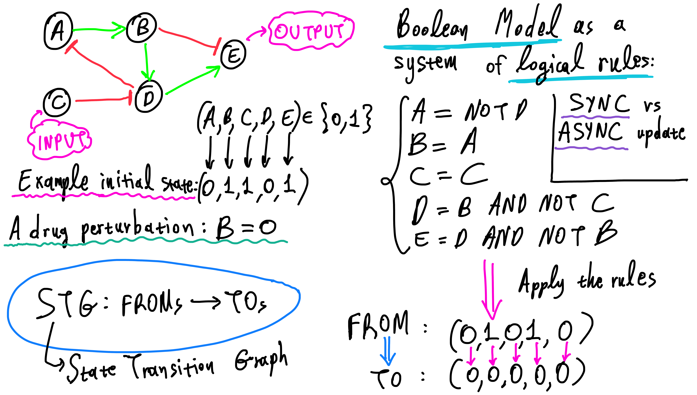
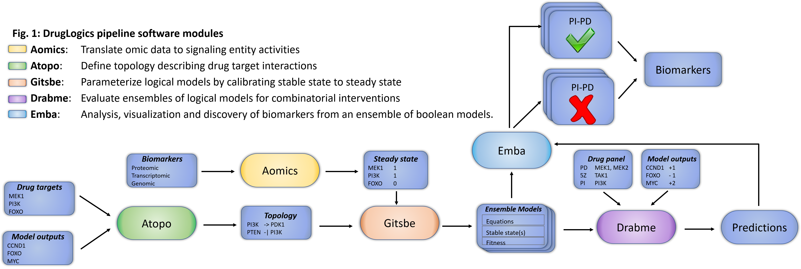
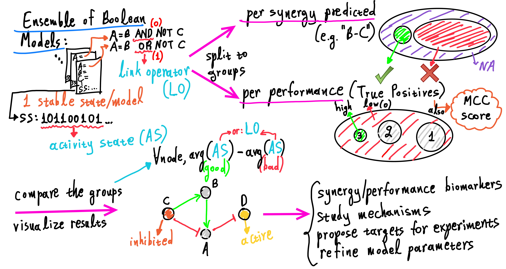
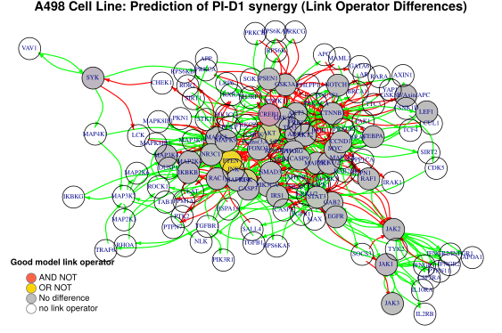

layout: true

<div class="my-footer">
<span>
  
</span>
</div> 

---

# Outline 

### - DrugLogics

### - Logical Modeling

### - The DrugLogics Software Pipeline

### - Ensemble Boolean Model Analysis

### - Future Work .blue[`r shiny::icon("smile")`]

---

# DrugLogics .smaller[(in keywords!)]


---

# Logical Modeling in Systems Biology


Flobak A. et al. (2015). Discovery of drug synergies in gastric cancer cells predicted by logical modeling. PLoS Comput. Biol. 11:e1004426. doi: [10.1371/journal.pcbi.1004426](https://doi.org/10.1371/journal.pcbi.1004426)

---

# Intro to Logical Modeling


--

**Model System Dynamics**: find *attractors* (fixpoints, etc.) and apply reasoning

---

# The DrugLogics Software Pipeline


--

- Fully **automated**
- Genetic algorithm trains **ensemble of boolean models**
- Designed for preclinical, **cancer cell line systems**
- **Goal**: clinical decision support for **personalized medicine**

???

We have designed and developed a fully automated computational pipeline for drug response simulation and prediction in preclinical, cancer cell line model systems. This pipeline is able to produce cellular signaling network models that represent key cancer driving processes, actionable targets within these networks, and phenotypic output nodes (growing or dying) that provide an assessment of model performance when compared to actual observations. The logical modeling framework deploys a genetic algorithm that trains an ensemble of models to fit the steady state activity profile of a specific cancer cell line, as measured with proteomic, genomic and transcriptomic data. The platform represents our progress in the direction of providing predictions of pre-clinical efficacy, and ultimately clinical decision support for personalized medicine.

---

# Ensemble Boolean Model Analysis .smaller[(Intro...)]

## .red[`r shiny::icon("question")`] Research questions .red[`r shiny::icon("question")`]

- Understand *why* specific drug combinations work better (more **synergistically**) than others
- Investigate *when* synergistic drug combinations should be prescribed to cell lines (or patients)
- Identify network nodes (**biomarkers**) that explain the mechanism by which these synergies happen

--

## emba R package

Github `r shiny::icon("github")`: [https://github.com/bblodfon/emba](https://github.com/bblodfon/emba)

```{r install, eval=FALSE}
devtools::install_github("bblodfon/emba")
```

---

# Ensemble Boolean Model Analysis .smaller[(How it works!)]


--

```{r emba_usage, eval=FALSE}
# With emba you simply write:
res = biomarker_tp_analysis(model.predictions, models.stable.state, 
  models.link.operator, observed.synergies, threshold = 0.7)
```

---

# *emba* : visualize biomarker results (1)

```{r gen_graph_from_A498_model_analysis, include=FALSE, eval=FALSE}
res = biomarker_synergy_analysis(model.predictions, models.stable.state, 
                                 models.link.operator, observed.synergies, 
                                 threshold = 0.7)

plot_avg_state_diff_graph(net, diff = res$diff.state.synergies.mat["PI-D1",],
                          layout = nice.layout, 
                          title = "A498 Cell Line: Prediction of PI-D1 synergy (Activity State Differences)")
plot_avg_link_operator_diff_graph(net, diff = res$diff.link.synergies.mat["PI-D1",],
                                  layout = nice.layout, 
                                  title = "A498 Cell Line: Prediction of PI-D1 synergy (Link Operator Differences)")
```


---

# *emba* : visualize biomarker results (2)



---

# Future Work

**Full analysis based on automatically generated topology**: [https://bblodfon.github.io/gitsbe-model-analysis/atopo/cell-lines-2500/a498-model-analysis.html](https://bblodfon.github.io/gitsbe-model-analysis/atopo/cell-lines-2500/a498-model-analysis.html)

--

- Perform *emba*-enabled analysis on 
  - Different cell lines
  - Different topology (**Cascade**)
--

- Biomarker results can be used to **calibrate training steady state size** for 
prediction performance improvement

--
- Use **Machine Learning methods** to perform *feature extraction*
  - Linear Regression Models with Regularization (LASSO, Elastic Nets) 
  - Random Forests 
  - Effective combinations of the above

--

... and of course the R package is still in the making!

---

# Acknowledgements .smaller[(.red[`r shiny::icon("heart")`] our sponsors!)]

.pull-left-large[
  
  
  
]
 
.pull-right-small[
  
  
  
  
  
  
  
]

---

class: center, middle

# Thanks!

Slides created via the R package [**xaringan**](https://github.com/yihui/xaringan).

Code for these slides: [https://github.com/bblodfon/r-pres](https://github.com/bblodfon/r-pres)
`r shiny::icon("github")`
