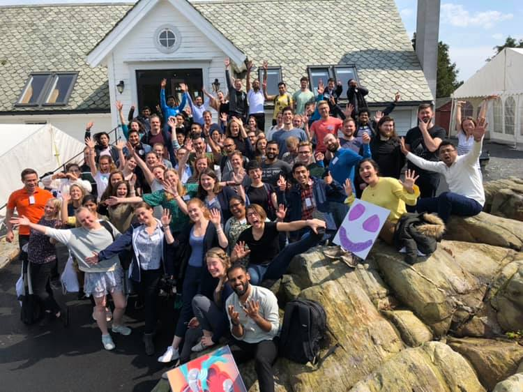
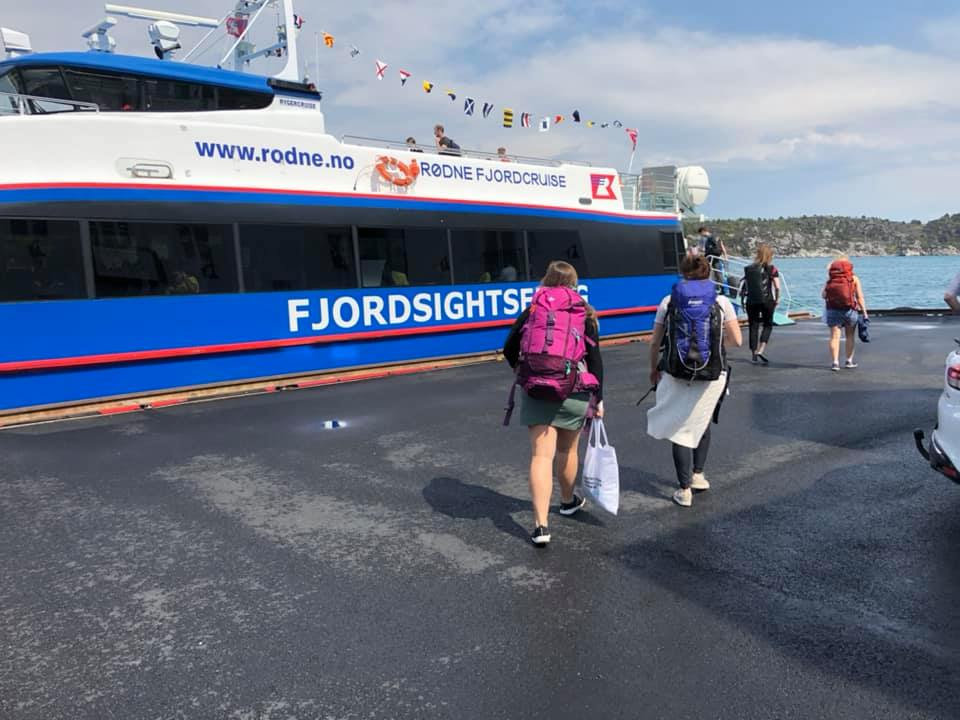
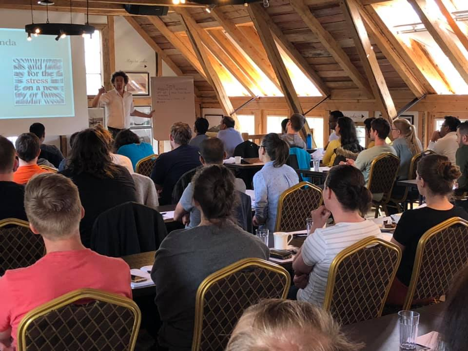
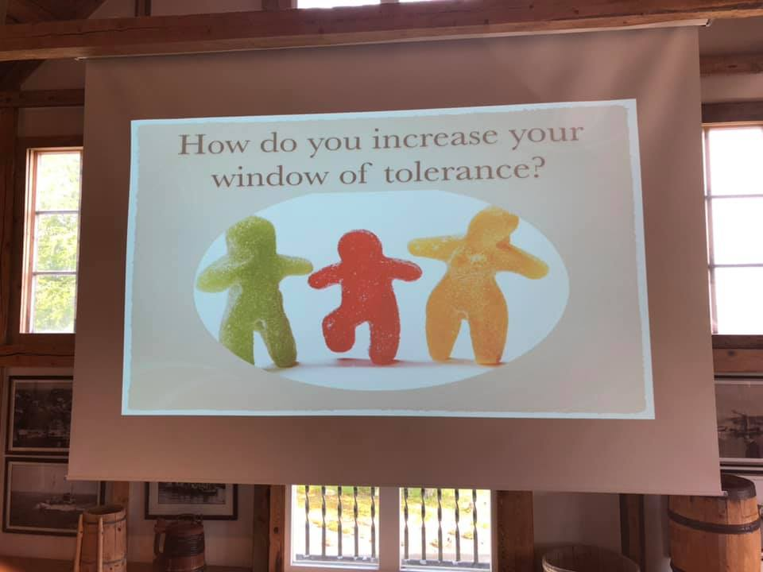

layout: true

  

 

---

# The conference 

.pull-left[
  
]

.pull-right[
 
]

---

# The conference 

.pull-left[
  
]

.pull-right[
 
]

--

.center.bottom[
  # Main Theme: **Sell Yourself!!!**
]

---

# [Pluvia](https://pluviabiotech.com/): Bio-Tech company built from basic research .small.green[(talk by Prof Aurora Martinez, UiB)]

--

- **Phenylketonuria (PKU)**, an inhereted, metabolic disease

--

  - Causes intellectual disability

--

- Ways to counteract (diet, drugs, ...)

--
 
- Through basic research (UiB), a **new method** was found
  - PKU is a conformational disease
  - Use of *pharmacological chaperons* to fix the *protein folding*
  - Potential for innovation

--

- Discuss the business plan afterwards
  - Patent the technology
  - Good basic research is always a prerequisite

---

# Innovation & Science Communication   .small.green[(talk by Anne-Sophie Schillinger)]

**VIS** is a company owned by UiB and its *mission* is to identify, evaluate, 
develop and realize research results they believe may have commercial and / or 
socio-economic potential.

--

- Describe your research in 7 words!

--

.larger.purple[Use computers to combat cancer] `r shiny::icon("dumbbell")`

--

- Well... that was less. So I re-did it as: 

.larger.blue[Use fancy computer methods to combat cancer]

--

- In 3 words:

--

.larger.red[Computers combat cancer] `r shiny::icon("smile")`

--

### Simplicity, Conciseness, Precision...

---

# How to get the job you want   .small.green[(talk by Sverre Haugen)]

--
### 6 principles to get the job you want

- Understand employers
- **Understand yourself**
- Understand the job
- Job-specific communication
- **Show motivation**
- **Use examples**

--

### CV checklist

- [Checklist](https://github.com/bblodfon/myCV/blob/master/CV_Checklist_Sverre_Haugen.pdf)
- [My CV](https://bblodfon.github.io/my-cv/cv.html) (made with the R package [pagedown](https://github.com/rstudio/pagedown)

---

# How to get the job you want   .small.green[(talk by Sverre Haugen)]

### What do the best interview candidates have in common?

--

- Self-knowledge `r shiny::icon("praying-hands")`
- Humbleness `r shiny::icon("pray")`
- Ability to reflect `r shiny::icon("yin-yang")` 
- Well prepared `r shiny::icon("user-graduate")`

--

### General advice

- Find your [**Ikigai**](https://en.wikipedia.org/wiki/Ikigai) (生き甲斐)
- [Fake it to make it](https://www.youtube.com/watch?v=RVmMeMcGc0Y) (for the 
interview and in general)
- Watch out for the **knock-out criteria** in a CV/job

---

# Mental Health .small.green[(talk by Jan-Martin Berge)]

### Tools for managing stress

--

.large.purple[Essential]

- Sleep
- Workout

--

.large.purple[If need ever comes...]

- Talk to someone
- Take a bath and go out

--

.large.purple[Zen stuff]

- Breathing
- Meditation / Mindfulness 
- Tea

---

class: center, middle

# Thanks!

Slides created via the R package [**xaringan**](https://github.com/yihui/xaringan).

My own NTNU template for [these slides](https://github.com/bblodfon/r-pres/blob/master/dln_conf_june_2019.Rmd).
