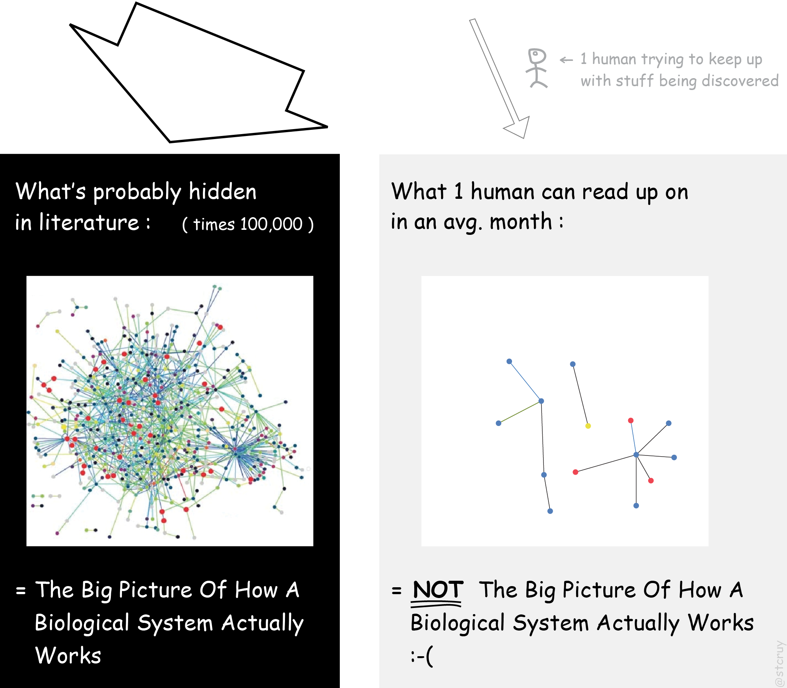

layout: true

  

 

---

# Outline

.big[
<ul>
  <li>Intro: .red[Understanding the Problem(s)]</li> 
  <li>VSM: .green[Visual Syntax Method]</li> 
  <li>Example app: .purple[causalBuilder]</li> 
</ul>
]

---

# The Science Machine

--

.bigger.center.red[IT IS NOT SO!]

???

Picture of what a perfect science system should be:
"Where everyone builds on top of what others found out before. 
And everyone shares their new findings with all the others, in an efficient way. 
So the next scientist can immediately build further, upon the new sum of human knowledge.
So that we eventually can reach the TRUTH!!!"

---

# Data vs Information

Monkey named 'Lukas', Subject No. 5, ate 4 bananas! (**NUMERICAL DATA**)  
.center[

 .smaller[Source: https://www.telegraph.co.uk/news/earth/wildlife/10570569/Banana-ban-for-health-kick-monkeys-at-Paignton-Zoo.html]]

... vs "Monkeys prefer bananas over pizza!" (**INTERPRETED DATA**)

--
<ul>
  <li>Data are structured, information can be in .bold[any form]!</li>
</ul>
  ... like an abstract/summary of a paper!
--
<ul>
  <li> Information comes with .big.purple[**CONTEXT!**]</li>
</ul>

---

# Why is context so important?

.larger["The cat ate the fish. Now **IT** is dead” => **WHO DIED**?]

.pull-left[]
--
.pull-right[.larger[Add .purple[**CONTEXT**]:  “The fish was poisoned” => **NOW WHO DIED**?]]
--
 
.center.big.red[ CONTEXT FACILITATES REASONING!]

???
It’s super hard to make a computer program ‘understand’ stuff like that, and especially in science... 
It would need to learn all about how the world works first, before it can decipher text.

---

# The knowledge pile

&emsp;&emsp; .large[Not just .red.large[**BIG**], but also .purple.large[**COMPLEX**] information]

 
.small[Source: https://www.nlm.nih.gov/bsd/medline_cit_counts_yr_pub.html]

---

.large[It takes .purple.large[**TIME**] for a human to *understand* and *process* text]

---

# Discovery effort disproportionate with result accessibility (free-text)

???
We are spending monumental efforts to make plenty of discoveries, but then we 
bury them all again into a **free-text format** that’s hardly accessible at all!

---

# Biocurators: .small[the Guardians of the Life Sciences]

----

Natural Language .green[information] => Biocuration => .green[Computable Information]

----

<ul>
  <li>Good-hearted and often underpaid people that read PDFs all day!</li> 
  <li>...and fill in the databases we so much use!</li> 
  <li>Make information .bold[easily reusable], either for themselves or for others</li> 
</ul>

???

And try to decipher what the cryptic authors actually meant to say. 
And sometimes need to email them to be sure. 
And then nicely package it so it fits on the trains.

Yes, a lot of work goes into filling the databases.
Even though some scientific funding managers think this just happens magically.

---

# State of the Art: Biocuration Tools

<ol>

<li> .bold[Sheets/Tables] </li>
  

<li> .bold[Formal/Math Languages] (<a href="https://language.bel.bio/">Biological Expression Language</a>) </li>

‘<em>repression of the transcription of miR-21 by FOXO3 protein transcriptional activity</em>’ => <code>act(p(HGNC:FOXO3),ma(tscript)) =| r(HGNC:MIR21)</code>

<li> .bold[RDF/Semantic-based tools] (<a href="http://noctua.geneontology.org/">Noctua Modeling Tool</a>)</li>

 Used by experts in knowledge management

</ol>

???
- Databases/Sheets: INFLEXIBLE
- Formal Languages: long list of rules and symbology! HARD TO LEARN for curators. 
And then the computer may misunderstand them when a rule is forgotten: "John eats chicken with fork!"
- RDF-based tools are used by experts in knowledge management

---

# The Problem: How to piece all this knowledge together?

.pull-left-large[]

.pull-right-large[
<ul>
    <li>We miss pieces from the puzzle!</li> 
    <li>We do not <b>fully benefit</b> from the decades of expensive research results that exist out there!</li> 
    <li><b>Modeling and understanding</b> all the complexity becomes infeasible</li> 
</ul>
]

???
...using the previous curation tools and knowledge as it currently is being represented...

---

# A Horse Analogy!

Communication in science is like living in the .red[mid-1800s]!!!

--

.larger[
<ul>
  <li>.purple[**Trains**]: structured data whooshes from mind to mind on rails!</li> 
  <li>.green[**Horses**] are .bold[too slow] but .bold[really popular]!</li> 
  <li>.green[**Complex**] vs .purple[**one-type**] cargo</li>
</ul>
]
---

class: center

---

# The Tesla Moment

.center.large[.purple.large[**TESLA**] => Easy-to-use tool that is used to create digital summaries of **PDFs**!]

--

.center.large[(...and remember: **"Hold your horses!!!"**)]

???
... a tool with which the computer can do something meaningful - apply **reasoning** and solve the cancer problem in the next slide!
"hold your horses:" Scientific prose is still valuable for showing how conclusions were reached and why they are meaningful!

---

# VR-game: Beat The Cancer genes

 
.center.large[... a tool that applies .purple.large[**REASONING**] and solves the cancer problem!]

???
When you tell a computer everything you know about some biological system, it can let you explore that system in a kind of abstract “Virtual Reality“ (VR)!

Then you can play around in this dynamic, digital, simulated world. You can modify one or two things, and study how many many other things are logically bound to react.You can also test if what you know so far about biology makes sense on its own, by checking of your virtual world responds in the same way as real-world biological experiments do. And you can hypothesize which tiny things you could fix, in order to change the entire virtual world’s state from e.g. ‘cancer’ to ‘healthy’.

---

# What new technology is needed?

---

class: center, middle, inverse

# VSM: .green[Visual Syntax Method]

---

# Visual Syntax Method: .green[*VSM-terms*]

.larger[
- Like words of a language, but clearer - **not ambiguous**!

- A VSM-term is always a specific ‘*thing*’

- VSM supports **homonyms** and **synonyms**
]

???

- The **VSM-Connector** is derived from the **RDF** triple: (Subject, Relation, Object)
- **Homonym**: terms with multiple meanings
- **Synonym**: multiple terms may be used to represent the same concept

---

# Visual Syntax Method: .green[*VSM-connectors* + *VSM-Principles*]

--

The .red[3 principles]:
- **Reformulate** the information
- Think all **terms as nouns** or *things*
- Connectors make **terms specific** (enriching meaning by adding .purple[**context**])

**Combine 2+3** => connecting more terms, thus making them even more specific!

---

# Visual Syntax Method: .green[*VSM-box* &nbsp;Example]

- Play at http://scicura.org/vsm/examples.html

---

# VSM app: .purple[*causalBuilder*]

- A web tool that supports the annotation of molecular causal interactions, following the [MI2CAST guidelines](https://github.com/MI2CAST/MI2CAST/blob/master/docs/MI2CAST_guideline.md)

--
- Let's annotate a paper: ["Characterization of E2F8, a novel E2F-like cell-cycle regulated repressor of E2F-activated transcription" by Christensen et al. (2005)](https://doi.org/10.1093/nar/gki855)

- A **biocurator** read the paper and wrote the following nice summary:

.just[‘**E2F8** is a *protein* that **down-regulates** the **transcription** of **CCNE1** *gene*. 
This causal statement has been a *manually assessed* from a **luciferase reporter gene assay** that is described in the **Christensen et al.'s article**. 
In the experiment, both entities were engineered: CCNE1's transcription regulatory region only and E2F8 has been overexpressed.
This causal statement occurs in **human**, specifically in this example, in the **nucleus of the human osteosarcoma cell line**’]

.center[]

---

# Example annotation with .purple[*causalBuilder*]

---

# Acknowledgements .smaller[(.red[`r shiny::icon("heart")`] our sponsors!)]

.pull-left-large[

Special thanks to: **Steven Vercruysse** (VSM creator), **Vasundra Touré** (MI2CAST, causalBuilder) and **Martin Kuiper** (Supervision)]

.pull-right-small[
  
  
  
  
  
  
  
]

---

class: center, middle

# Thanks!

*VSM pages*: http://scicura.org/vsm/intro.html

*causalBuilder*: https://vtoure.github.io/causalBuilder/

----

Slides created via the R package [**xaringan**](https://github.com/yihui/xaringan)

Code for the slides: [https://github.com/bblodfon/r-pres](https://github.com/bblodfon/r-pres)
`r shiny::icon("github")`
