layout: true

<div class="my-footer">
<span>
  
</span>
</div> 

---
class: middle

# Outline

# 1) .large.blue[Introduction]

----

# 2) .large.blue[Thesis Papers .small[(Motivation + Results)]]

---
class: center, middle

# .larger.blue[Introduction]
----
# What is the problem?

---

# What do people die from?

.center[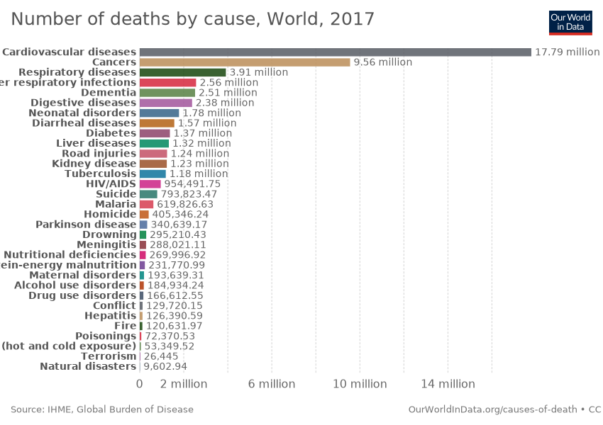]

.purple.small[Ritchie & Roser (2018). Causes of Death. https://ourworldindata.org/causes-of-death]

???

- 56 million people died in 2017
- Every sixth death was due to **cancer** (globally).
- The **Global Burden of Disease** is a major global study on the causes of death and disease published in the medical journal *The Lancet*

---

# .little[Combating disease: from genes to networks]

.pull-left-73[.center[]]
.pull-right-27[
.purple[Dawkins (1976). The Selfish Gene]

.purple[Kitano (2002). Computational systems biology]

.purple[Noble (2008). The music of life: biology beyond genes]
]

???

- 1950's: Birth of Molecular Biology (Discovery of DNA, Central Dogma: DNA makes RNA, and RNA makes protein)
- 1990 - 2003: Human Genome Project
  - International scientific collaboration
  - **Aim**: Sequence the human genome
  - **Promise**: revolutionize and transformation therapeutic medicine
- *Reductionism*/*Gene Determinism*: breaking down parts, analyzing these parts
  - Didn't help to understand disease - except from very specific-gene-associated diseases)
- *Systems Perspective*: **Integration rather than breaking down parts**
- Metaphor for Reductionism vs Systems perspective: *A book isn't just the letters in the book, but you reading, thinking about it, at a specific time/place, with your experience and previous collective readings, etc.*

- New experimental and computational approaches
- From genomics to multi-omics (**BIG DATA**): genes, protein, complexes, transcriptomics, methylation, phopshorylation, processes, interactions
- Mathematical approaches to model complex biological systems
- **Computational sciences have became more important**
- To answer the BIG questions (why disease happen?) you need a **systems view/perspective**

---

# Cancer is a complex signaling disease

.pull-left[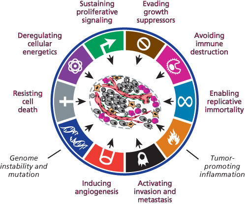
<br><br>
.purple.small[Hanahan & Weinberg (2011). Hallmarks of cancer: the next generation]
<br>
.purple.small[Yaffe (2019). Why geneticists stole cancer research even though cancer is primarily a signaling disease]
]

.pull-right[
<br>
<br>
<br>
.small["*Living cells are a symphony of complex processes*"<br> **Jonathan Ronen** <br>*Computational genomics with R*]
]

???
- **Hallmarks of cancer**: a number of characteristics that normal cells acquire towards the path of becoming cancer cells

---

# Towards Personalized Systems Medicine

.center[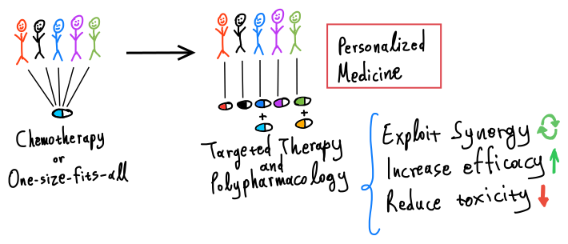]

.bold.blue.larger[Goals]

1. Find optimal **drug-patient matches**
2. Exploit **Big Data** and **Mathematics/Modeling**
3. Understand the **mechanisms** that drive disease

.purple.small[Apweiler (2018). Whither systems medicine?]

???

- **Systems Medicine**: integrate, analyze and interpret data from different resources and produce new knowledge, based on which, personalized therapies can be developed.
- *All for the patient's benefit*
- **Polypharmacology** is the design or use of pharmaceutical agents that act on multiple targets or disease pathways
- **one-size-fits-all** approaches have gradually been replaced by **targeted therapies** with predictive biomarkers of response

---
exclude: true

# Modeling

- Testing hypotheses *in silico* and generate new ones for experimental validation
- Generating experimentally testable biological hypotheses
- Make predictions about things that are not tested yet experimentally

---

class: center, middle

# .larger.blue[Paper 1]
----
# UniBioDicts: Unified access to Biological Dictionaries
----

---

# Motivation

.center[]

???

- **Biocurators**: make knowledge *computable* and easily reusable
- Molecular Interaction standards
- Curation tools
- Need for uniform access to **Controlled Vocabularies (CVs)** and **ontologies**
- Data formats

---

# MI2CAST: .green.small[The Minimum Information about a Molecular Interaction Causal Statement]

.center[
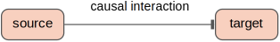

]

**Guidelines**: https://github.com/MI2CAST/MI2CAST/blob/master/docs/MI2CAST_guideline.md
.small.purple[Touré (2020). The Minimum Information about a Molecular Interaction Causal Statement (MI2CAST)]

???

- 3 elements of a causal statement: the source entity, the causal interaction and the target entity

---

# **V**isual **S**yntax **M**ethod: .green.small[General-purpose curation tool]

.center[]

- More info: https://vsm.github.io/vsm-pages/intro

.small.purple[Vercruysse and Kuiper (2020). Intuitive representation of computable knowledge]

???

- Think all **terms as nouns** or *things*
- Connectors enrich meaning by adding **context** to terms
- Meaning is applied by **trident connectors**: (Subject, Relation, Object) - SRO!
- Easier annotation using an autocomplete function

---

# causalBuilder: .green.small[Web-based curation interface for the annotation of molecular causal interactions]

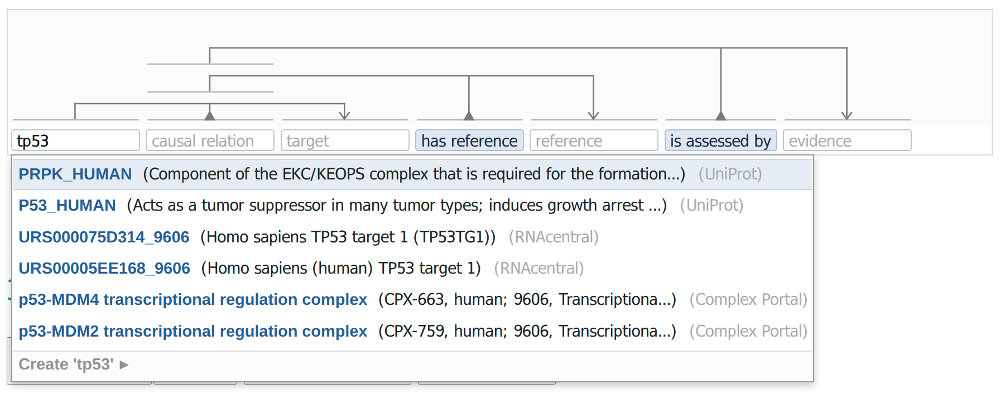

Supports **CausalTAB** export!

.small.purple[
Touré (2021). CausalBuilder: bringing the MI2CAST causal interaction annotation standard to the curator

Perfetto (2019). CausalTAB: the PSI-MITAB 2.8 updated format for signalling data representation and dissemination
]

???

- **CausalBuilder**: an intuitive web-based curation interface for the annotation of molecular causal interactions that comply with the *MI2CAST* standard
- MITAB 2.8 == CausalTAB, user friendly, Excel-compatible
- UBDs search query functionality is supported by an **autocomplete** function that allows users to **choose from a list of candidate terms with descriptive metadata**.

---

# : .small.green[Unify Life Science terminologies] 

> A single programmatic interface to search *terms*, *identifiers* and some *metadata* from several resources

.pull-left[
## Implemented UBDs

- BioPortal .purple[Whetzel (2011)]
- PubMed (biomedical literature)
- Noctua Entity Ontology
- UniProt .purple[The UniProt Consortium (2019)]
- Ensembl .purple[Zerbino (2018)]
- Ensembl Genomes .purple[Howe (2020)]
- RNAcentral .purple[The RNAcentral Consortium (2018)]
- Complex Portal .purple[Meldal (2019)]
]

.pull-right[
## Potential Users

1. **Research software engineers** (as a meta-API)
2. **Curation tool developers** (e.g. causalBuilder)
3. **Biocurators** (as tool users)

----

GitHub Organization: https://github.com/UniBioDicts/ `r shiny::icon("github")`

]

???

- The recommended ontologies from MI2CAST were the **motive** to started playing with APIs that gave access to various Life Science terminologies.
- A collection of software packages/dictionaries that connect to each separate API
- A combiner-dictionary package that **combines the results from multiple UBDs**, reporting them back through a single channel

---

class: center, middle

# .larger.blue[Paper 2]
----
# Linking PubDictionaries with UniBioDicts to support Community Curation
----

---

# Motivation

.big1[
## .red[Curation Problems]

1. Constant **refactoring** of ontologies
2. Not-yet-covered domains or novel fields:
  - **No authoritative** database or ontology
  - **No community consensus** on terminology
3. Need for **project-specific, ad-hoc** CVs
4. **Openness** and **sharing**
  - Facilitate review and management
]
---

# Pubdictionaries and new UBD Client

.pull-left-67[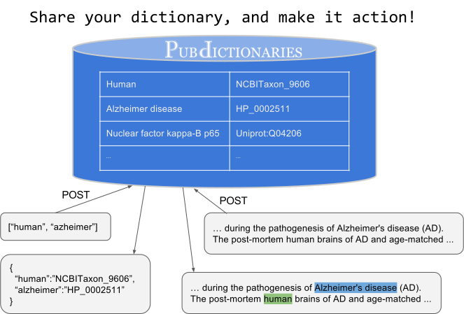]
.pull-right-33[
- ELIXIR BioHackathon 2020

- Update PubDictionaries API

- Implement new UDB client

- [Example Demo with vsm-box](https://github.com/UniBioDicts/vsm-pubdictionaries/blob/master/test/test_vsm_box_pubdictionaries.html)
]

<!-- SOS: CREATE SPACE SO THAT THE PARAGRAPH GET BELOW THE TWO COLUMN LAYOUT-->
<br/>&nbsp;<br/>
<br/>&nbsp;<br/>

.purple.small[Kim J.-D. (2019). Open Agile text mining for bioinformatics: the PubAnnotation ecosystem]


---

class: center, middle

# .larger.blue[Paper 3]
----
# Fine tuning a logical model of cancer cells to predict drug synergies: combining manual curation and automated parameterization

----

---

# Motivation

.big1[
1. < 4% of drugs succeed in clinical trials
2. Find **useful drug combinations** without resorting to blind-mechanism trials
3. **Automatize** logical modeling framework from .purple[Flobak (2015)]
4. Benchmark prediction performance
5. Assess importance of **training data and topology** for prediction performance
6. Mechanistic insights
]

---

# Logical Model of gastric cancer cells

.center[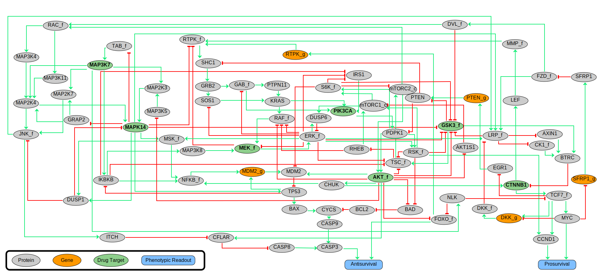]

- CASCADE 1.0 topology (75 nodes, 149 edges)
- **Manually optimized rules**
- **AGS** cell line
- 4 **experimentally confirmed synergies** out of 21 drug combinations
- Model identified *synergistic* effect of joint `PI3K` and `MEK` inhibition (**PI-5Z**)

.small.purple[Flobak (2015). Discovery of drug synergies in gastric cancer cells predicted by logical modeling]

???

- 5 synergies predicted by the logical model, 4 TP + 1 FP

---

# Automation of model parameterization

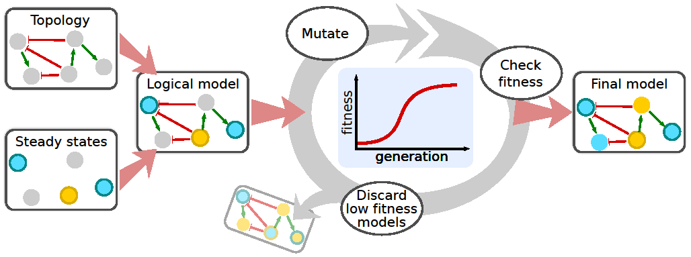

- From generic to **cell-specific models**
- Models **mutate** across generations
  - **Logical rule** mutations (AND-NOT <=> OR-NOT)
  - **Topology (edge)** mutations
- Parallel evolutionary simulations: **ensemble of models**

Genetic algorithm for creation of logical model ensembles: https://github.com/druglogics/gitsbe `r shiny::icon("github")`

???

- From a naive model (agnostic of cell activity states) to a **cell-specific model**
- Explain training data

---

# Prediction performance: CASCADE 1.0

.pull-left[]
.pull-right[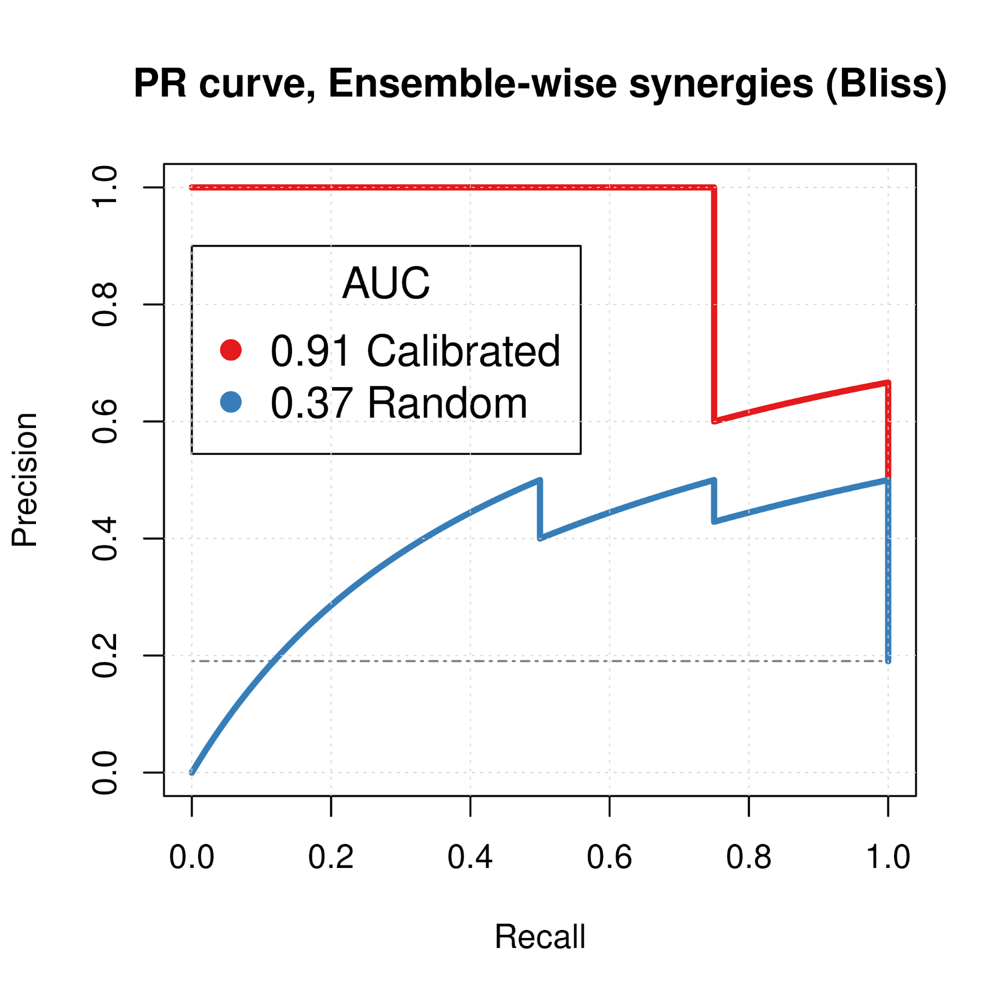]

- Automated pipeline performs on par with curated rules .purple[Flobak (2015)]
- **Top 6 predictions** include the 4 validated synergies
- **Calibrated better than Random** (proliferation profile)

Synergy assessment analysis module: https://github.com/druglogics/drabme `r shiny::icon("github")`

???

- **Explain differences** between ROC (validation) vs PR (prevalence/balance of data)
  - Validation means better than random classifier (ROC-AUC=0.5)
  - PR more proper for imbalanced data .purple[Saito (2015)]
- Normalization of synergy scores to topology predictions (Random)
- **Random => random yet proliferative** training data profile
- We could in principle have reduced our full drug screen to only test 29% percent of the
combinations (6 out of 21), had we guided our experiments by model simulations
- Chosen a synergy threshold of 0, 15 of 21 are synergistic!

---

# Prediction performance: CASCADE 2.0

.pull-left[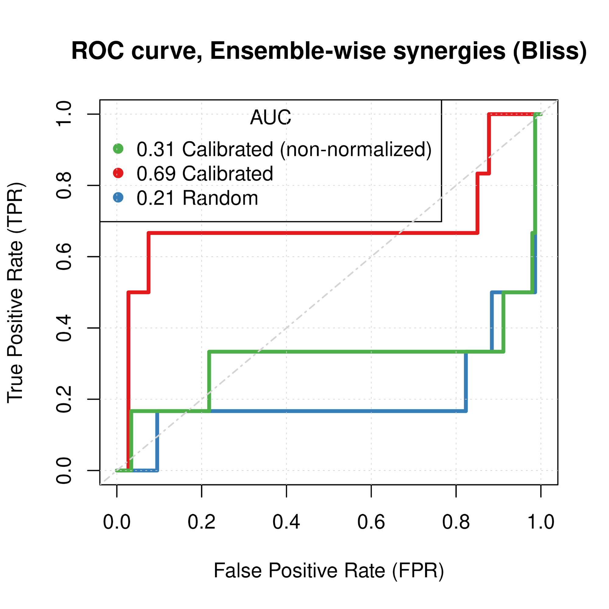]
.pull-right[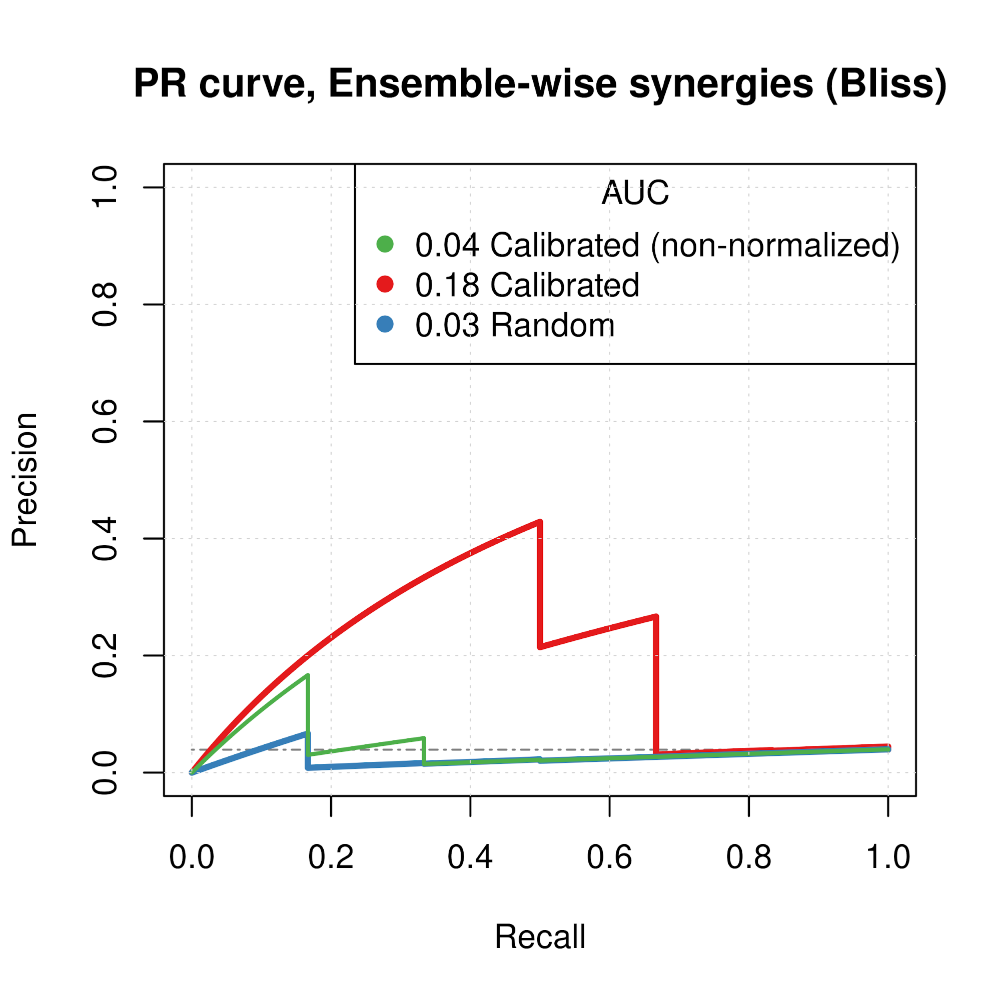]

- Larger topology (144 nodes, 367 edges)
- Larger screen (153 drug combinations) from .purple[Flobak (2019)]
- 6 **experimentally confirmed** synergies for AGS cells
- **Reduce full drug screen** to .green[24%] (36 combos, .red[miss 2 observed synergies])
- Importance of **normalization to topology predictions**

???

- The 6 synergies were identified computationally and via curation assessment from the growth curves of the Flobak (2019) dataset for all the cell lines

---

## Impact of data quality on model performance

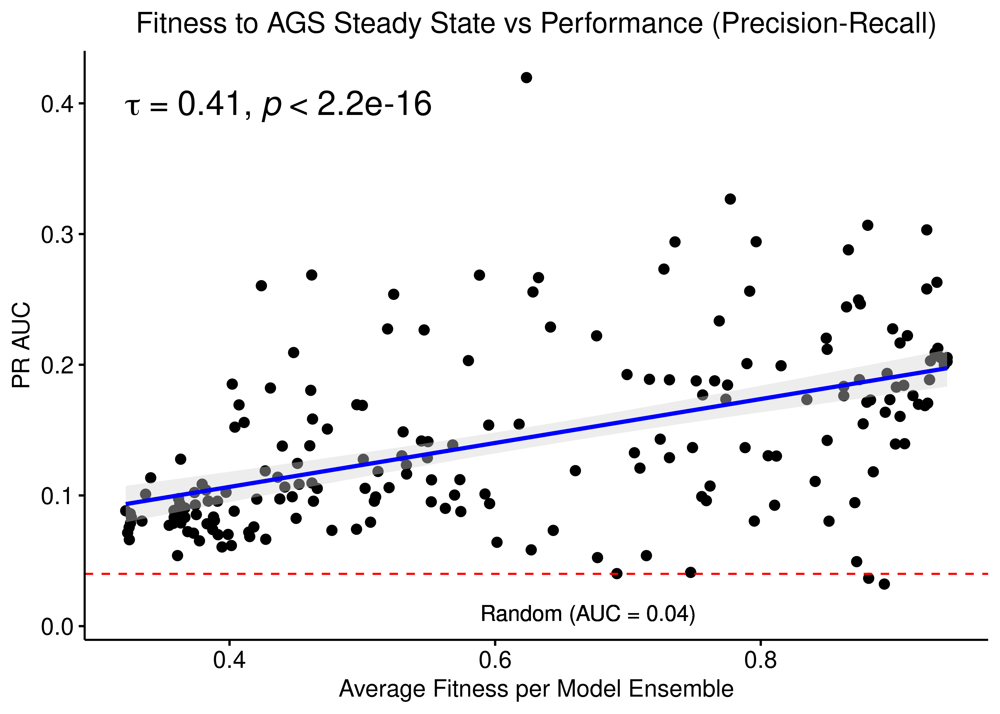

- Each model ensemble is trained to **partially incorrect data**
- .green[**Data quality affects performance**]
- Partially-fitted models predict **better than random** (PR AUC = 0.04)
  - **Topology** carries information for synergy prediction

---

### Impact of incorrect prior knowledge on model performance

.pull-left[
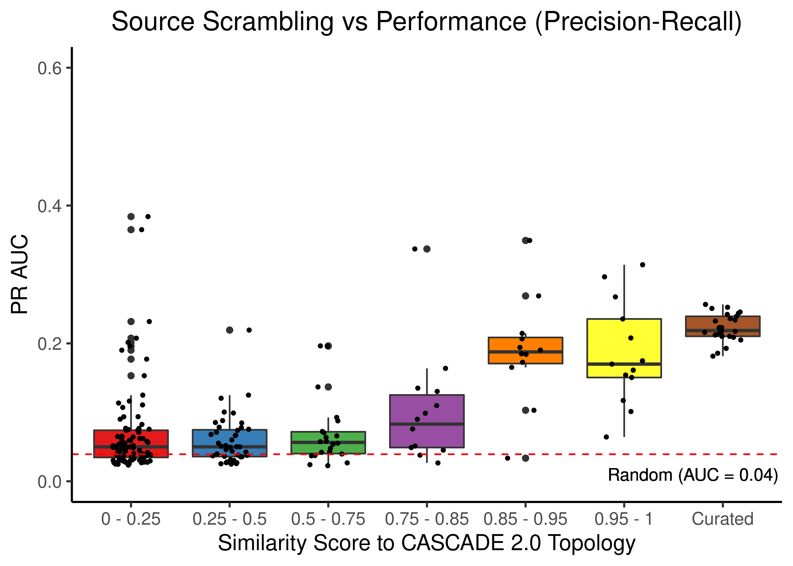
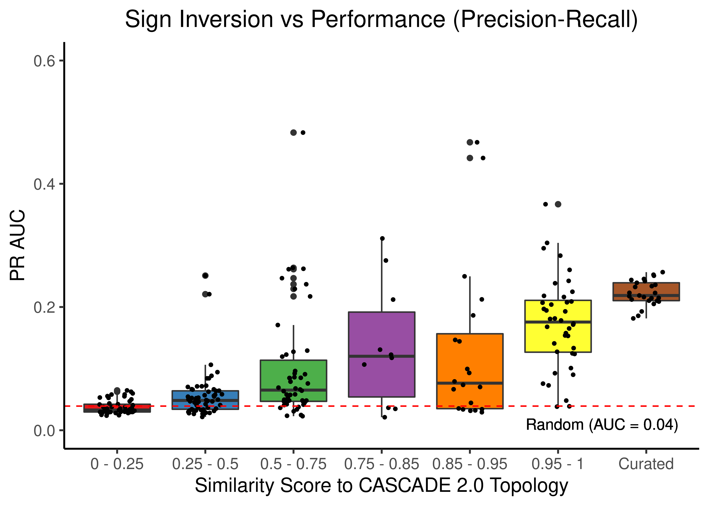
]
.pull-right[


]

.green[**Small randomization decreases prediction performance**]

???

- Explain key analysis steps that resulted in these figures
- 3 types of topology scrambling + all these applied together
- **Even low levels of randomization in the curated knowledge significantly reduce the predictive power of the models**

---

# Model ensemble heterogeneity

.pull-left-67[]
.pull-right-33[
- Larger heterogeneity in parameterization space

- Many logical rule configurations yield biologically compliant models

- Calibrated models respect the training data

- Violation of training data in:
  - **JNK** signaling
  - **ERK** signaling
  - **p38** signaling (MAPK14)
]

---

# Mechanistic insights (1)

.pull-left[
#### Active Oncogenes vs inactive Tumor Suppresor Genes

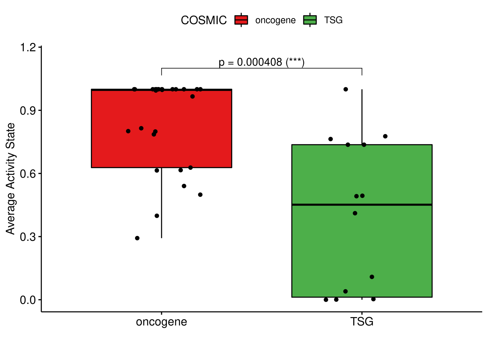

.small.purple[Sondka (2018). The COSMIC Cancer Gene Census: describing genetic dysfunction across all human cancers]

]
.pull-right[
#### ERK active in AGS cells

- Conflicting evidence of ERK activity in literature

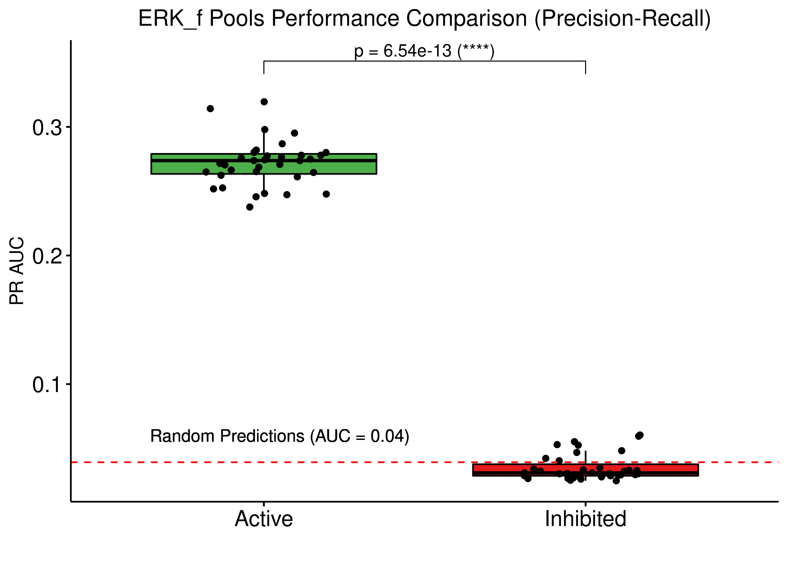
]

???

- **Biological explanations for some of the observations**
- **Cancer Gene Census (CGC)** describes a curated catalogue of genes driving every form of human cancer
- Proteins from genes annotated as oncogenes in COSMIC tend to be active, while proteins from genes annotated as tumor suppressor genes (TSG) tend to be inactive in overall steady states. This is biologically plausible and attests to the **capability of our
mechanistic model to generate hypotheses about the underlying molecular biology**.
- **Conflicting evidence of ERK activity in publications**! 
- ERK-active sub-ensemble is more predictive, suggesting that from a functional point of view ERK should be considered active in AGS cells.

---

# Mechanistic insights (2)

.pull-left-58[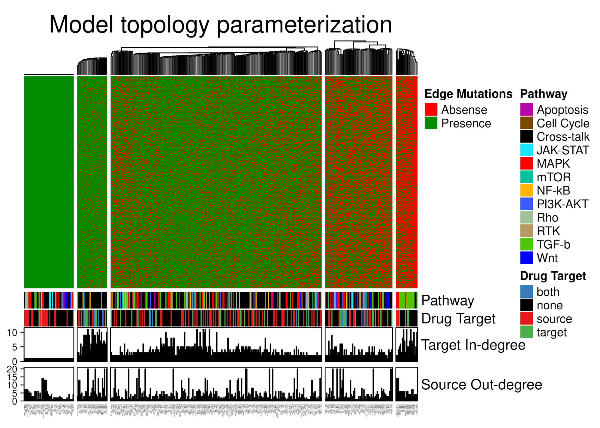]
.pull-right-42[
<br>
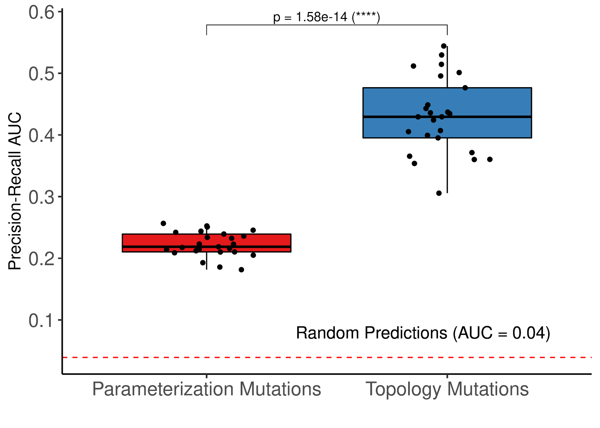]

<br/>&nbsp;<br/>

- Model performance improves by **omitting correct prior knowledge**
- **Cross-talk edges** are likely to be .bold.green[preserved]
- **TGF-beta pathway edges** are likely to be .bold.red[removed]

???

- TGF-b edges removed are about **inhibitory effects of the protein SKI and other inhibitors of SMADs**
- Preserve of cross-talk might be due to:
  - Sparse prior knowledge (biased pathway interactions) => Asmund has written that in the paper, but ~50% of the edges are crosstalk in CASCADE 2.0!
  - Importance of signaling that is not confined to what is more or less arbitrarily viewed as pathways

---
exclude:true

# Validation of PZ-PI synergy *in vivo*

.pull-left[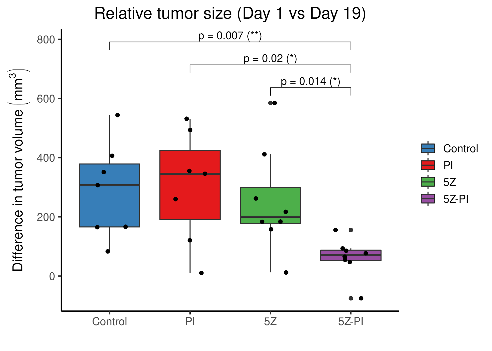]
.pull-right[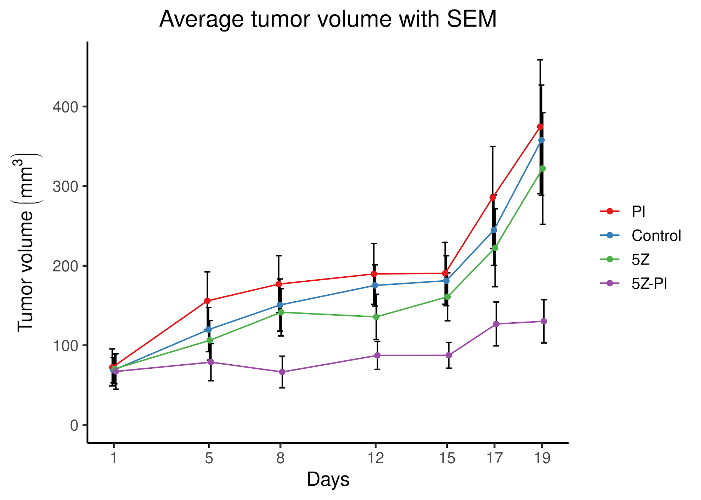]

???

- Testing of drug synergy in a mouse xenograft model

---

class: center, middle

# .larger.blue[Paper 4]
----
# emba: R package for analysis and visualization of biomarkers in Boolean model ensembles

----

---

# Ensemble Boolean Model Analysis .green.smaller[(How it works!)]


CRAN `R` package: https://github.com/bblodfon/emba `r shiny::icon("github")`

???

- Explain figure
- Why is emba important for others? 
  - Data analysis software for same kind of datasets
  - Find biomarkers
  - Comparing results with other methodologies
  - Refining model parameters (as stated in the figure)

---

# Visualization of biomarker results

```{r, eval=FALSE}
library(emba)
*res = biomarker_synergy_analysis(model.predictions, models.stable.state, models.link.operator, observed.synergies, threshold = 0.7)

plot_avg_state_diff_graph(net, diff = res$diff.state.synergies.mat["PI-D1",], layout = nice.layout, 
  title = "A498 Cell Line: Prediction of PI-D1 synergy (Activity State Differences)")

plot_avg_link_operator_diff_graph(net, diff = res$diff.link.synergies.mat["PI-D1",], layout = nice.layout, 
  title = "A498 Cell Line: Prediction of PI-D1 synergy (Link Operator Differences)")
```

.pull-left[]
.pull-right[]

???

- Library is very easy to use (once you have the data :)
  - Development effort/abstraction that led to an **one-liner**!
- The visualization helps you pinpoint the biomarkers and see if they are close or not
  - (Depends on the size of the networks of course and the number of returned biomarkers)
  - Might be better than looking at the data results when few biomarkers
  - Comparing parameterization and stable state differences in a visual way
- This sort of visualization and analysis led to the discovery of the `ERK_f` activation patterns in our boolean models and inspired the ensemble-based analysis for mechanistic insights in paper 3.

---

class: center, middle

# .larger.blue[Paper 5]
----
# Boolean function metrics can assist modelers to check and choose logical rules

----

---

# Motivation

.large[
1. **No single right BRF**:
  - Noisy data
  - Sparse data
  - Discrete data & modeling
  - Enormous function space: $2^{2^n}$
2. Which equations **make sense**?
  - **Semantics**
  - Check **regulatory consistency** from formula?
3.  $f_{AND-NOT} \rightarrow 0$, $f_{OR-NOT} \rightarrow 1$, for large $n$
  - Proof?
  - Biased behavior?
  - How large $n$ needs to be practically?
  - Effect of number of activators $m$ and inhibitors $k$?
4. Metric that defines **expected function output** for every BRF?
  - Compare different link operator functions?
  - Use this knowledge to better **match observations**?
]

???

- Boolean Function Space is **double exponential**

---

# Some notation...

- Boolean regulatory functions $f_{BRF}:\{0,1\}^n \rightarrow \{0,1\}$
- **Link operator functions** with a total of $n = m + k$ regulators:
  - $m \ge 1$ .green[activators] $x=\{x_i\}_{i=1}^{m}$
  - $k \ge 1$ .red[inhibitors] $y=\{y_j\}_{j=1}^{k}$

- $f_{AND-NOT}(x,y) = \left(\bigvee_{i=1}^{m} x_i\right) \land \lnot \left(\bigvee_{j=1}^{k} y_j\right)$, from .purple[Mendoza (2006)]

- $f_{OR-NOT}(x,y) = \left(\bigvee_{i=1}^{m} x_i\right) \lor \lnot \left(\bigvee_{j=1}^{k} y_j\right)$

- $f_{Pairs}(x,y) = \bigvee_{\forall (i,j)}^{m,k}(x_i\land \lnot y_j) = \left(\bigvee_{i=1}^{m} x_i\right) \land \left(\bigvee_{j=1}^{k} \lnot y_j\right)$

- <p><b>Threshold functions</b>: <span class="math inline">\(\begin{align}  f_{Act-win}(x,y) &amp;= \begin{cases}  1, &amp; \sum_{i=1}^{m} x_i \ge \sum_{j=1}^{k} y_j \\  0, &amp; \text{otherwise} \end{cases}  \end{align}\)</span>, where activators "win" on equality, otherwise: <span class="math inline">\(f_{Inh-win(x,y)}\)</span></p>

???

- **Threshold functions**: the activities of the positive and negative regulators are combined in an **additive** manner (and not **combinatorial**), with their respective assigned weights set to ±1 and the threshold parameter to 0, formulating thus a **majority rule** which defines the value of the function.

---

# Interpretability issues in Boolean modeling

.pull-left-67[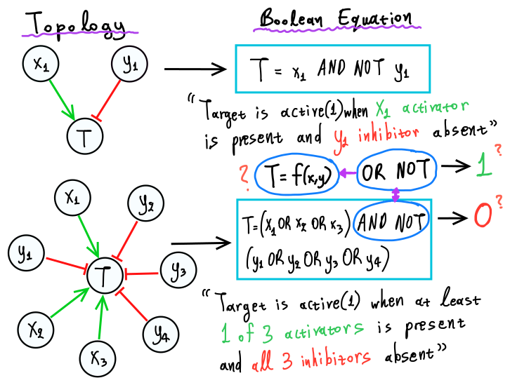]
.pull-right-33[
- Exact conditions that make target **active**?

- More regulators, more complexity!

- Other link operators?

- Other BRFs?

- Derive **meaning** directly from formula?

- Check **consistency** with regulatory topology
]

???

- Can I, by looking at the formula, derive a meaningful characterization, one that allows me to compare it with others?
- Make sense? => consistency with underlying regulatory topology

---

# DNF and Consistency metric

- **D**isjunctive **N**ormal **F**orm (**DNF**) links **semantics** with **mathematics**!
- .purple[Cury (2019)] - **Consistent** BRFs:
  1. Activators $\neq$ Inhibitors (no dual regulations, *monotone* BRFs)
  2. All regulators are *essential*
  3. **Unique Complete DNF** (CDNF)
      - <span style="color:green">Activators</span> are the *positive* literals $(x)$
      - <span style="color:red">Inhibitors</span> are the *negative* literals $(\lnot y)$

.blue[Example] with $2$ .green[activators] $(x_1,x_2)$ and $2$ .red[inhibitors] $(y_1,y_2)$:
.small[
|Link Operator BRF|CDNF|Biological Interpretation|Consistent|
|:---:|:---:|:---:|:---:|
|<span class="math inline">(<em>x</em><sub>1</sub> OR <em>x</em><sub>2</sub>)<strong> AND NOT </strong>(<em>y</em><sub>1</sub> OR <em>y</em><sub>2</sub>)</span>|<span class="math inline">(<em>x</em><sub>1</sub> AND NOT <em>y</em><sub>1</sub> AND NOT <em>y</em><sub>2</sub>)<strong> OR </span> <span class="math inline"></strong>(<em>x</em><sub>2</sub> AND NOT <em>y</em><sub>1</sub> AND NOT <em>y</em><sub>2</sub>)</span>|Presence of at least one activator **and** absence of all inhibitors|.bold.green[YES]|
|<span class="math inline">(<em>x</em><sub>1</sub> OR <em>x</em><sub>2</sub>)<strong> OR NOT </strong>(<em>y</em><sub>1</sub> OR <em>y</em><sub>2</sub>)</span>|<span class="math inline"><em>x</em><sub>1</sub><strong> OR </strong><em>x</em><sub>2</sub><strong> OR</strong></span>  <span class="math inline">(NOT <em>y</em><sub>1</sub> AND</span> <span class="math inline">NOT <em>y</em><sub>2</sub>)</span>|Presence of any activator **or** absence of all inhibitors|.bold.green[YES]|
|<span class="math inline">(<em>x</em><sub>1</sub> OR <em>x</em><sub>2</sub>)<strong> NAND </strong>(<em>y</em><sub>1</sub> OR <em>y</em><sub>2</sub>)</span>|<span class="math inline">(NOT <em>x</em><sub>1</sub> AND NOT <em>x</em><sub>2</sub>)<strong> OR</strong></span> <span class="math inline">(NOT <em>y</em><sub>1</sub> AND NOT <em>y</em><sub>2</sub>)</span>|Absence of all activators **or** absence of all inhibitors|.bold.red[NO]|
|<span class="math inline">(<em>x</em><sub>1</sub> OR <em>x</em><sub>2</sub>)<strong> NOR NOT </strong>(<em>y</em><sub>1</sub> OR <em>y</em><sub>2</sub>)</span>|<span class="math inline">(<em>y</em><sub>1</sub> AND NOT <em>x</em><sub>1</sub> AND NOT <em>x</em><sub>2</sub>)<strong> OR</strong></span>  <span class="math inline">(<em>y</em><sub>2</sub> AND NOT <em>x</em><sub>1</sub> AND NOT <em>x</em><sub>2</sub>)</span>|Presence of at least one inhibitor **and** absence of all activators|.bold.red[NO]|
]

???

- **DNF**: biological characterization can be directly derived from the formula itself
- **Results**: Only AND-NOT,OR-NOT,Pairs,Threshold function are consistent with the regulatory topology

---

# Truth Density: expected function output

.little[
|<span class="math inline"><em>a</em></span>|<span class="math inline"><em>b</em></span>|<span class="math inline"><em>c</em></span>|<span class="math inline"><em>f</em><sub>1</sub> = (<em>a</em> ∧ ¬ <em>c</em>) ∨ (<em>b</em> ∧ ¬ <em>c</em>)</span>|<span class="math inline"><em>f</em><sub>2</sub> = <em>a</em> ∨ (¬ <em>b</em> ∧ ¬ <em>c</em>)</span>|<span class="math inline"><em>f</em><sub>3</sub> = 1</span>|
|:---:|:---:|:---:|:---:|:---:|:---:|
|0|0|0|0|.bold.green[1]|.bold.green[1]|
|0|0|1|0|0|.bold.green[1]|
|0|1|0|.bold.green[1]|0|.bold.green[1]|
|0|1|1|0|0|.bold.green[1]|
|1|0|0|.bold.green[1]|.bold.green[1]|.bold.green[1]|
|1|0|1|0|.bold.green[1]|.bold.green[1]|
|1|1|0|.bold.green[1]|.bold.green[1]|.bold.green[1]|
|1|1|1|0|.bold.green[1]|.bold.green[1]|
]

- $TD = \{Prob: f = 1\}$
- $TD_{f_1}=3/8=0.375$, $TD_{f_2}=5/8=0.625$ and $TD_{f_3}=8/8=1$
- $TD \in [0,1]$
- $TD_f \rightarrow 1$ or $TD_f \rightarrow 0$ => **biased**
- $TD_f \rightarrow 1/2$ => **balanced**

???

- Truth density is also known as: **bias**
- **Balanced** terminology from Cryptography
- Limits on definitions of biased and balanced functions are used because we usually refer to the **change of a variable, like number of regulators**

---

## Truth density formulas and Asymptotic study

.pull-left[
$TD_{AND-NOT}=\frac{2^m-1}{2^n} = \frac{1}{2^k}-\frac{1}{2^n}$

$TD_{OR-NOT}=\frac{2^n-(2^k-1)}{2^n} = 1 - \frac{1}{2^m} + \frac{1}{2^n}$

$TD_{Pairs}=\frac{(2^m-1)(2^k-1)}{2^n}$

$TD_{thres} = \frac{\sum_{i=1}^m \left[ \binom{m}{i} \times \sum_{j=0}^{min(u,k)} \binom{k}{j} \right]}{2^n}$

---

**(2)** For a .green[.bold[high] activator-to-inhibitor ratio] $(m=n-1,k=1)$:

$TD_{AND-NOT} = TD_{Pairs} \rightarrow 1/2$

$TD_{OR-NOT} = TD_{thres} \rightarrow 1$

]

.pull-right-42[
**(1)** .green[For large n]:

$TD_{AND-NOT} \sim \frac{1}{2^k} \xrightarrow{k \rightarrow \infty} 0$

$TD_{OR-NOT} \sim 1-\frac{1}{2^m} \xrightarrow{m \rightarrow \infty} 1$

$TD_{Pairs}$ and $TD_{thres}$ depend on both $m$ and $k$

---

**(3)** For an .green[.bold[equal] activator-to-inhibitor ratio], $m \approx k \approx n/2$:

$TD_{AND-NOT} \rightarrow 0$, $TD_{OR-NOT} = TD_{Pairs} \rightarrow 1$
$TD_{thres} \rightarrow 1/2$
]
???

- $u=i$ for $f_{Act-win}$ and $u=i-1$ for $f_{Inh-win}$

---

# Validation and Comparison (1)

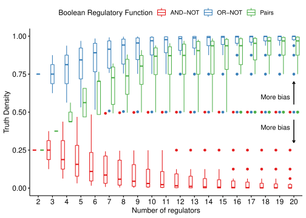

???

- Explain how to read the graph
- More **bias** with increasing numbers of regulators
- **7-10** regulators: that's where biased behavior starts
- For each specific number of regulators, every possible combination of at least one activator and one inhibitor that add up to that number, results in a different truth table output with its corresponding truth density value.

---

# Validation and Comparison (2)

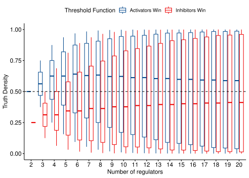

- More **balanced** behavior, following the activator-to-inhibitor ratio
- A larger spectrum of possible truth density values

---

# abmlog: .small.green[From Topology to AND/OR-NOT Boolean models]

.center[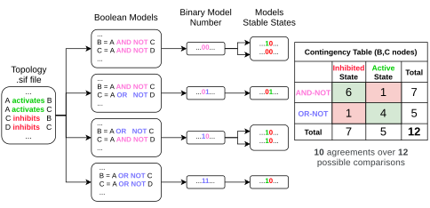]

**Agreement between parameterization and stable state**: $10/12=0.83$

**Per parameterization agreement**: $6/7$ (AND-NOT) and $4/5$ (OR-NOT)

https://github.com/druglogics/abmlog `r shiny::icon("github")`

???

- $83\%$ of the presented data, the link operator parameterization dictated function outcome

---

# Signs of bias in a cancer signaling network

<br>

.pull-left-67[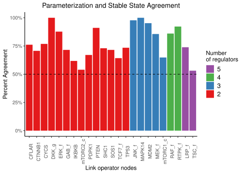]
.pull-right-33[
**Analysis**
- Use `abmlog` on CASCADE topology

- Keep single stable state models

- One Contingency Table per node

**Results**
- Agreement higher than random $(50\%)$

- Variability: **need for more regulators**!
]

???

- Used `abmlog` on CASCADE 1.0 (77 nodes, 149 interactions, 23 link operator nodes)
- Produced $2^23$ boolean models
- For the analysis I kept ~3 million models that had a single stable state => agreement easy to calculate
- **One contingency table per node**!
- **Higher than random probability** that the assignment of the "AND-NOT" (resp. "OR-NOT") link operator formula in the Boolean equations will result in the inhibition (resp. activation) of the target nodes.
- **Variable results** => need for more regulators!

---

# Bias guides model parameterization

.center[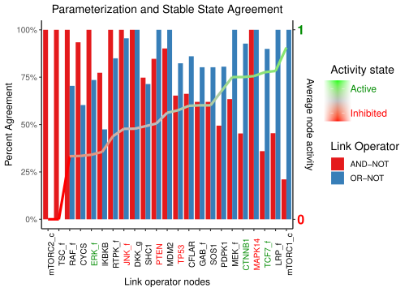]

- High correlation $(\rho_{and-not} = -0.74$, $\rho_{or-not} = 0.85)$
- *A priori* choose parameterization to match observations
- `LRP_f` $(m=4,k=1)$: $TD_{AND−NOT}=0.47$, $TD_{OR−NOT}=0.97$
- `TSC_f` $(m=1,k=4)$: $TD_{AND−NOT}=0.03$, $TD_{OR−NOT}=0.53$

???

- CASCADE models were split into two pools, representing the "AND-NOT" and "OR-NOT" node parameterizations, and calculated the proportion of models within each pool whose link operator matched the expected state outcome (percent agreement)
- The link operator nodes are **sorted according to the average activity state** across the considered CASCADE models
- Colored node labels indicate literature curated activity profiles from Flobak et al. [2015]
- **Correlation here is between activity and parameterization**
- A priori choosing parameterization - better than random implied!
- `TSC_f`: no model had it as active no matter the parameterization, which shows that **complex dynamics also play a role**. Activity state results may contradict what is expected from the asymptotic truth density results - e.g. I would expect **at least some active `TSC_f`** when it's with `OR NOT`!!!

Also: $TD_{AND−NOT}=0.03=1/32=1/(2^5)$

---

# Hub node bias in scale-free networks

.pull-left-58[
<br>
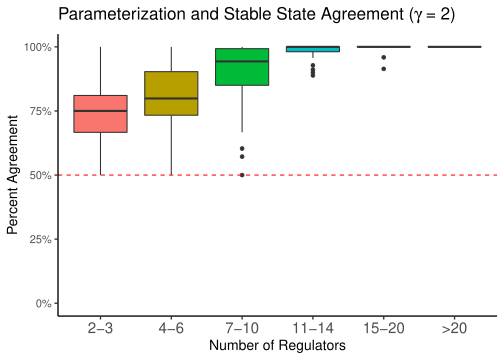
]
.pull-right-42[
**Analysis**
- Create many scale-free topologies $(\gamma = 2,2.5)$ <br>.small.purple[Aldana (2003)]
- Use `abmlog` on **each** topology
- Keep **all stable attractors**
- Compare $\gamma = 2$ vs $\gamma = 2.5$
  - More link-operator nodes
  - Higher maximum degree

**Results**
- Increasing agreement (.red[bias]) for #regulators $>7-10$
- AND-NOT => $0$, OR-NOT => $1$
]

???

- Scale-free networks as a proxy to biological networks (with some supported evidence)
- $n=50$ nodes per scale-free network
- $\gamma$ is the power-law exponent: Comparing the scale-free networks generated with two gammas we observe that the $\gamma = 2$ have **more link operator nodes** and **higher degree hubs** than networks with $\gamma = 2.5$
- In-degrees are drawn from Riemann Zeta distribution based on the work from .purple[Aldana (2003). Boolean dynamics of networks with scale-free topology]

---
exclude:true

# Other metrics...

- Sensitivity .purple[Shmulevich (2004)]
- Complexity .purple[Gherardi (2016)]

---

# Acknowledgements .smaller[(.red[`r anicon::faa('heart', animate='bounce', speed='fast')`] our sponsors!)]

.center.pull-left-67[


</img>

]

.pull-right-27[
  
  
  
  
  
  ----
  
  - .bold[[Code for slides](https://github.com/bblodfon/r-pres/blob/master/phd_thesis.Rmd)]
  - .bold[[PhD Thesis](https://bblodfon.github.io/my-phd-thesis/)]
]

???

- Pedro T. Monteiro
- Noemi Del Toro Ayllon, Henning Hermjacob (EBI Team)
- Denis Thieffry
- Jing-Dong Kim (PubDictionaries, BioHackathon)
