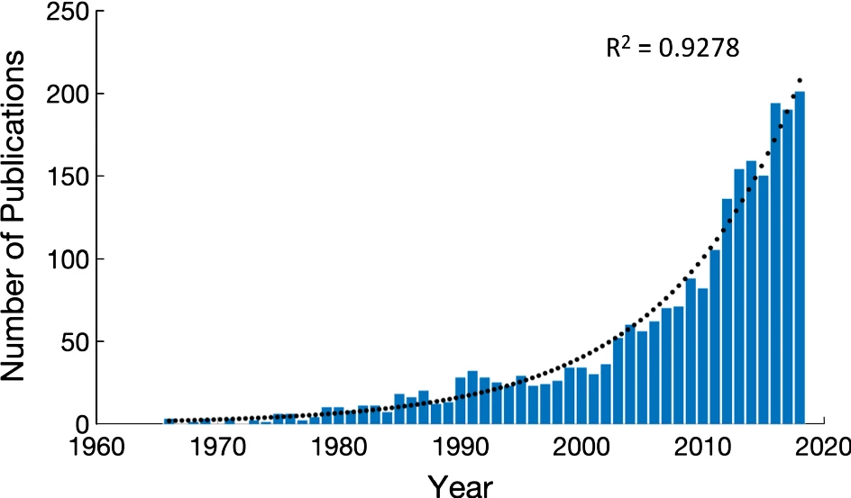

layout: true

  

---
class: middle

# Outline

## 1) .large.blue[Introduction to Cancer Modeling]

----

## 2) .large.blue[Computational Frameworks in practice]

???

- Present **some** frameworks, not all of them! 
- Use practical examples/applications and then discuss the associated frameworks
- Point is to **state the differences** and **highlight drawbacks and assets of each discussed framework in practice**
- Target audience is Master-level students

---
class: center, middle

# .larger.blue[Introduction to Cancer Modeling]
----
</img>

---

## Why study cancer?

- **2nd cause of death worldwide** .small.purple[Ritchie & Roser (2018)]
  - Problem exacerbates due to aging and population growth
- Curing every cancer type is impossible

## Why is cancer challenging?

- Research findings are **not translational**
  - *In-vitro* and *in-vivo* approaches are .red[not effective] in the clinic
  - .red[< 4% of drugs succeed] in clinical trials .small.purple[Wong (2019)]
  - Need for .green[basic science] and .green[integrative (in-silico) approaches]
- **High complexity**
  - Multiscale, dynamically adaptive process
  - Heterogeneity .small.purple[Senft (2017)]
      - Intra-tumor (within a patient)
      - Inter-tumor (patients diversity)
- **Acquired resistance to therapy**
- **Lack of biomarkers** that correlate with patient response
  - Need strategies for .green[patient stratification]
- **Lack or constrained access** to experimental and clinical data

???

- The cancer hallmarks .purple[Hanahan & Weinberg (2011)] as a guide to understand the complex processes that drive cancer

---

# How to study cancer?

.pull-left-58[
### The Scientific Method

]

.pull-right-42[
### Cancer Modeling popularity

.purple.small[Brady (2019). Mathematical models of cancer: when to predict novel therapies, and when not to]
]

 &nbsp; 

.little.purple[Rashevsky (1940). Mathematical biophysics in its relation to the cancer problem]

???

- Model/experiment refinement cycle is a cornerstone of Systems Biology approaches 
- Models are a mix of **Mathematics** (theory) and **computational** (software) tools
- Model-experiment (data production) iterative refinement pattern/cycle
  - Use models can make new predictions and drive new hypotheses for further experimental investigations (**faster and with less cost**) and **guide us towards more informative experiments**
  - 2 **optimization** self-loops can be used in both models and experiments nodes
- Rashevsky (1940) talks about:
1. The usefulness of theoretical research for experimental science
2. Mathematical study of cell division and its relation to cancer

---

# Goals of computational cancer modeling

???

- Be **explanatory/mechanistic** and enable **translational medicine**
- Predict new therapies (e.g. **identify new targets** or synergistic drug combinations)
- Personalized treatment: **optimal drug-patient match**, optimize individualized cancer therapy
- Patient stratification (biomarkers) - **overcome patient diversity** (*Whe does a particular treatment work only in a fraction of patients?*), more accurate diagnostic tests
- Optimize clinical trial design (e.g. **better dosing schedules, optimize chemotherapy delivery, reduce drug toxicity**)
- Deliver robust and reproducible results
  - **VVUQ**: verification, validation (match observations - multiomics/patient data) and uncertainty quantification .small.purple[Groen (2021)]
  - **Patient-specific** results!
- **Data Integration and AI** => mention the promise of **IBM’s Watson**: applications to radiology and
diagnoses aided by wearable technology amongst
many others. Each of these examples are exciting, but
the full promise of personalized medicine remains
unrealized. While the amount and types of clinical data
being generated for each cancer patient is increasing
dramatically, there are no holistic approaches or
algorithms available that can incorporate all this data
to identify the best treatment for each individual
patient.

---

# Modeling frameworks: an overview

.pull-left-58[

]

.pull-right-42[
### .center[What to consider?]

- Discrete to continuous state and treatment of time
- Spatial information

- Stochasticity of reactions

- Structure vs dynamical

- Black-box vs White-box

- Area of application
]

 &nbsp; 

- .green[Biological detail] `r shiny::icon("arrow-up")` = .red[Data] + .red[Computation Demand] `r shiny::icon("arrow-up")`
- Moving towards **multiscale hybrid modeling**

???

### Granularity in species' states and treatment of time (**non-spatial**)

.small[
1. **Logical modeling**
  - .purple[Kauffman (1969)] - seminal paper in the field
  - .red[Discrete time steps] and active/inactive outputs (e.g. Boolean 0/1) - can also be multi-valued
  - .green[Easy rule formulation, high interpretability, less data are needed for training]. 
  - .red[Discretization of continuous data to Boolean is challenging].
  - .green[Attractors are **biologically meaningful**]:
      - Cell fates (phenotypes)
      - Stable patterns of cell activity (e.g. cell cycle or T cell differentiation)
  - **GINsim**, and other tools, see **CoLoMoTo** .purple[Naldi (2018)] paper
2. **Ordinary Differential Equations (ODEs)**
  - Time is an independent, continuous variable 
  - Species concentrations are the unknowns
  - .red[Need for data (kinetic rates, concentration parameters)]
  - Software **Tellurium** (.purple[Choi (2018)]): ODE solving, parameter estimation, visualization
3. **Mixed Discrete-Continuous (hybrid) modeling**
  - .green[Pro: Simplicity of logical modeling without the need to specify kinetic rates, but still output is continuous]
  - Example 1: Logic-ODEs .purple[Wittmann (2009)]
  - Example 2: Fuzzy Modeling .purple[Morris (2016)]
  - Example 3: Stochastic Boolean Modeling (MaBoSS 2.0 .purple[Stoll (2017)])
  - **CellNOpt** .purple[Gjerga (2020)]: software that offers a lot of the above example frameworks + training and optimizing models to perturbation data
]

### PDEs and Stochastic models

.small[
- **Partial Differential Equations (PDEs)**
  - Time + space as unknown variables, .red[hard to solve in general]
  - Example 1: **Calcium (Ca2+)**, a fundamental intracellular signal, that achieves specificity over wide temporal and spatial changes
  - Example 2: Cell geometry, compartments (e.g. in whole-cell modeling)
- **Stochastic modeling**
  - Reaction processes are not deterministic .green[More realistic models]
  - .green[Molecular quantities are low] (#species <100-1000)
  - .red[Need to solve the even harder **CME (Chemical Master Equation)**]: distribution of species across time and space
  - Approximate solutions: stochastic simulation algorithm (**Gillespie** algorithm + variations)
  - Particle-based methods (MD: **Molecular Dynamics**: solve equations for every atom in the system!)
]

### Structural/network vs dynamical/mechanistic models
  
.small[
- Structural models are network-based (connectivity)
  - .green[Exploit topological properties (e.g. graph theory) to derive associations/prove hypotheses/make predictions]
- Dynamical are mathematical models (so networks + equations)
]

### White-box vs Black-box models
.small[
- .red[Accuracy vs. Interpretability trade-off], see .purple[Breiman (2001). Statistical Modeling: The Two Cultures]
- White-box: **mechanistic/hypothesis-driven**, use knowledge
  - ODEs, Boolean modeling, simple statistical models (linear regression, decision trees)
- Black-box: **empirical/data-driven**, .red[use A LOT of data]
  - Random forests, NNs, Deep Learning
- Grey-box: new Neural Network approaches
]

### Area of application

.small[
- **Tumor growth**, metabolism, vasculature, **microenvironment, immunity**, invasion, **treatment and resistance**, etc.
- Important for considering the modeling framework
]

### Multiscale hybrid modeling

.small[
- Moving from **scale-specific** to **multiscale models**
- Incorporating different biological scales is important for **clinical translation**
- **Software** for multiscale modeling:
  - .green[Example]: Use ODEs or logical models for intracellular signaling and agent-based modeling (ABM) for interactions between cells (**PhysiBoSS** = PhysiCell + MaBoSS, see .purple[Letort (2018)])
  - **COPASI** (.purple[Hoops (2006)]): ODEs and stochastic simulations or hybrids of these
  - **Chaste: Cancer, Heart and Soft Tissue Environment** .purple[Cooper (2020)]
      - Cardiac electrophysiology
      - Cell-based modeling, application in tissue carcinogenesis
      - Multiscale lung ventilation simulations
  - **Virtual Cell** .purple[Blinov (2017)] (rule-based framework): combines ODEs + Stochastic + agent-based modeling.
]

---
class: center, middle

# .larger.blue[Computational frameworks in cancer]
----
## Examples from current research

</src>

.small.purple[Game of Life, John Conway]

???

- Game of Life is a famous **Cellular Automaton (CA)**, demonstrating **how complexity can arise from simple rules**
- **Epilog** .purple[Varela (2018)]: software that defines an CA in 2D to represent a multi-cellular environment using a logical model framework for describing cell behavior

---

## Genomic data cannot explain complex cancer behavior

.pull-left-58[]
.pull-right-42[
&nbsp; &nbsp; .bold[Dataset] .small.purple[Eduati (2017)]

- 14 heterogeneous colon cancer cell lines
- 14 measured phosphoproteins
- 43 perturbed conditions
  
&nbsp; &nbsp; .bold[Observations]

- .red[No correlation] between perturbation response and CMS (*) or genotype data
- Signaling is .red[not determined by mutations]
- Use modeling to .green[gain insights] on signaling changes

&nbsp; &nbsp; .small[(*) CMS = consensus molecular subtype]
]

???

### A large-scale experimental perturbation dataset

- 14 **genetically heterogeneous** colorectal cancer cell lines grouped to 4 molecular subtypes (according to .purple[Guinney (2015)])
- Cell lines cover typical recurrent mutations in colorectal cancer (such as KRAS, TP53, APC, BRAF)
- 43 perturbed conditions (**7 inhibitors**, 5 ligand-stimulating receptors)
- 14 measured phoshoproteins
- Results differ strongly between cell lines
- **No clear correlation between genotype data or consensus subtype and perturbation response data**
- State and responsiveness of the signaling is not fully determined by mutations
- **Dataset provides information that is not contained in genomic data** 
  - Use of modeling to get insights on the network/signaling changes that lead to these heterogeneous responses

---

## .little[Cell-specificity achieved with logic-based ODE modeling]

.pull-left-58[

.red.bold[Drawbacks]

- Manually curated PKN .small.purple[Türei (2016)]
- Parameter Optimization
- Regularization
  - Prioritize good fit to data
  - Keep the model sparse
]

.pull-right-33[
### Logical rules to ODEs .small.purple[Wittmann (2009)]

.green.bold[Assets]

.little[
- Minimum model complexity
- Interpretable parameters
- Continuous signal and time dynamics
]]

???

### Prior Knowledge Network (PKN)

- Manually curated
- `OmniPath` .purple[Türei (2016)] (49 nodes, 86 edges)
- Compress PKN to reduce model complexity without affecting logic consistency

### Mixed Discrete-Continuous Modeling Framework

- ODEs to capture the .green[continuous aspects] of signal strength and time dynamics
- Logic formalism to .green[keep the model simple and with easily interpretable parameters]
- **Translate Logical rules to ODEs** using .purple[Wittmann (2009)], implemented in the `CNORode` R package, part of the `CellNOpt` family of tools .purple[Gjerga (2020)]
  - Each node is associated with a speed/responsiveness parameter $\tau$
  - Each edge/interaction is associated with a strength parameter $k$
- .red[Parameter optimization] to create cell-specific models
  - **Regularization** to fit the training perturbation data which results in network sparsity (fewer nodes and edges)
  
### Heterogeneity of cell-specific models

- **More than half of the edge parameters were zero** => indicating signaling interactions not present in colon cancer (edge width denotes that)
- .green[Edge width in the PKN image shows the heterogeneity]: the associated numbers denote the proportion of pair-wise comparisons (out of $91={14 \choose 2}$) between cell lines, that have statistically different edge parameters $(k\text{ 's})$
- Edge-parameter and tau-parameter heatmaps also show heterogeneity (Fig. 4c in the paper)

---

# .small[Model parameters elucidate drug sensitivity mechanisms]

.pull-left-58[
.bold[Parameter-drug associations (GDSC)]

.bold[GSK3i with fixed MEKi]

.little[.red.bold[Note:] Genomic data can't derive such associations!]
]
.pull-right-42[

.green.bold[Assets]
- **Mechanism-based** therapeutic strategy
- **Personalized** combinatorial treatment
]

???

- Exploit drug response data from **GDSC** screening (drug sensitivity, IC50)
- Choose **27 drugs** (mostly ones that were tested in all 14 cell lines and target nodes in the PKN)
- Find if there are associations between cell line sensitivity for the tested drugs and the model parameters
- .green[Association 1: MEK-ERK parameters => EGFR signaling + BRAF signaling]
  - **Evidence** (in colorectal cancer): combination of EGFR (or BRAF) and MEK inhibitors has been suggested to overcome resistance to MEK inhibitors in BRAF and KRAS mutants
- .green[Association 2: GSK3 parameters => MEK inhibitors]
  - **Hypothesis**: colon cell lines resistant to MEK inhibitors and having high functional GSK3, will benefit from **GSK3 inhibition** (suggest new therapeutic strategies - they validated it experimentally)
- These associations couldn't be unveiled with genomic data!
- Such associations between model parameters and drug sensitivity are useful for personalized combinatorial therapies

---

## A large-scale ODE mechanistic model .small.purple[Fröhlich (2018)]

.pull-left[

- Curated, SBML format, .green[reusable]
- Model structure .red[uncertainty]
]

.pull-right[

- .red[Parameter estimation] .smaller[(reaction rates)]
- .green[Scalable] optimization with parallel computing
- .green[Cell-specificity] (120 cell lines)
  - Gene expression 
  - Somatic mutations
]

???

- Filling in the need for high-quality mechanistic large-scale ODE models
  - **Curated** from the meta-database `ConsensusPathDB` .purple[Herwig (2016)]
  - .green[Reusable] model, exported in green.[standard SBML format]
  - .green[Curated model]
  - .green[Model can be individualized to particular cell lines], so various cancer types and treatments
  - .red[Model structure uncertainty]: while the model is based on extensive literature and was manually curated, .red[interactions might still be missing or incorrect.]
  - .green[Suitable for prediction of drug sensitivity]
      - Includes the targets of 7 small molecular inhibitors
      - The authors suggest that .red[even larger models are needed] for a rigorous mechanistic description of the polypharmacology of anti-cancer drugs
- .red[Parameter estimation and optimization for cell-specificity (reaction rate constants)]: Parameterization of the model to **120 cell lines from CCLE** (using only gene expression and mutation data).
  - .green[Scalable and parallelized optimization] by an order of magnitude: data training with 400 cores **took < 1 week** (compared to years that it would take with other methods)
  - The gradient evaluation time was dramatically reduced by using adjoint sensitivities, exploiting sparsity, and parallelization.

---

## Mechanistic models vs standard ML methods

.pull-left-67[
.bold[Performance comparison]

.large[
- .bold.green[Similar predictive power]
- No prior knowledge and parameterization required for ML methods
]
]

.pull-right-33[
.bold[Dataset split]

.little.bold[Dose-response predictions]

]

???

- **Dataset**: viability results of 7 drugs x 9 concentrations x 120 cell lines
- `d` defines up to which network distance interactions were considered in `lasso` method.
So this method took not only mutation and gene expression data, but also network topology as input!
- Mechanistic modeling performs equally well compared to other statistical methods (lasso, random forest for example).
**These methods top performers in previous drug sensitivity prediction DREAM challenges**
- Prediction of cell viability (single drug dose-response curves, DV90 is the cell line, PD{digits} is the drug)

---

## Molecular insights from mechanistic ODE modeling

.pull-left-67[

]

.little.pull-right-33[

### &nbsp; &nbsp; Mechanistic models

- Parameters .green[link to cancer biology]
- Elucidate drug's MoA
- Predict combination treatment from single-drug data

### &nbsp; &nbsp; Statistical methods

- .red[No mechanistic insights]
- Do not exploit prior knowledge
- Cannot predict latent variables (*)

&nbsp; &nbsp;.small[(*) not experimentally measured]
]

???

### Parameters link to cancer biology

- Parameters are reaction rates in these ODE models. Unlike parameters from statistical methods these provide **direct information about the underlying biological network**. Analysis showed large parameters uncertainties, which though didn't account for most of the errors in predicted viability (mostly due to prediction bias). Since studies have shown the fraction rates have lower uncertainty, they computed **equilibrium constants as the ratio of on (forward) and off (backward) rates of reversible reactions** (conversion of reactants to products and the conversion of products to reactants occurs simultaneously). .green[Parameters different from 1 are important for the observed drug sensitivity]. 9 such parameters were identified. Of these parameters, .green[5 out 9 link to cancer biology]:
  - 3 had to do with **receptor dimerization reactions** (or simply put complex formation), which are known to be important in cancer signal transduction
  - 1 enables the activation AKT, which is associated with increased cancer cell proliferation and survival in many cancer types
  - 1 is a binding linked to paradoxical activation, **driving the resistance in melanoma**

### Resistance and Susceptibility Markers Elucidate Drug Primary **Mode of Action (MoA)**

- Compute **cell-specific resistance (susceptibility) and sensitive biomarkers** using adjoint sensitivity analysis (sensitivity of output variables - cell viability - to input variables, positive/sensitive or negative/resistant)
- Derived a generalized set of candidate important markers (significant p-values) across all drugs used to build a simplified and high-level signaling network (a)
- Receptor targeting drugs revealed **similar mode of action (MoA)** and **similar classification of markers** within pathways [(b)-(d)]:
  - EGFR-SRC-STAT signaling responsible for **heterogeneity in drug sensitivity**
  - MAPK-PI3K signaling responsible for **heterogeneity in drug resistance**
  - .green[Information about signal flow] (.red[not possible with ML models])

### Predict drug combination response

- ML methods cannot predict drug combination data without being given drug combination data for training!
- Another example of a very accurate drug combination prediction algorithm using tensor factorization method (order 5) that could outperform RFs is **comboFM** from .purple[Julkunen (2020)]. It predicts:
  - Missing entries in dose-response matrices
  - Dose-response of same two drugs, in a different cell line (tissue)
  - Dose-response of new drug combos in the same cell line
  - .red[But still they needed at least some drug-combo data to train on]!

---

# Deep Neural Networks

- Visual Neural Network model: DrugCell paper (white-box ML)s

---

## .little[PhysiCell: 3D growth simulation of a heterogeneous tumor]

.pull-left-58[
<iframe width="95%" height="315" src="https://www.youtube.com/embed/16EyDBf0l_M" title="YouTube video player" frameborder="0" allow="accelerometer; autoplay; clipboard-write; encrypted-media; gyroscope; picture-in-picture" allowfullscreen></iframe>

.blue.bold[Spatiotemporal dynamics]

.little[
- Loss of tumor symmetry and homogeneity
- Cell mechanics drive proliferation
- .red[2 weeks] worth of calculations!

.purple[Ghaffarizadeh (2018)]
]
]

.pull-right-42[
.large.bold[Agent-Based Modeling]

.green.bold[Assets]

- Lattice-free
- Autonomous agents
- Incorporate space and stochasticity
- Utilize parallelism
- Reproduce emergent behavior
- Intuitive for multi-cellular modeling

.red.bold[Drawbacks]

- Lack of mechanistic interpretation
- Computationally intensive
]

???

### Agent-Based Modeling (ABM)

.small[
- **Lattice-free** modeling (compared to CA, which are mostly 2D, grid-based only).
- **Autonomous agents** freely interacting with one another over time and space by exchanging messages
- Environment is non-deterministic, so **agents have to learn and adapt their behavior** to achieve their goals
- .green[easily incorporate space, stochasticity, utilize parallelism]
- .green[reproduce *emergent properties*] (dynamics not possible to infer from agents alone)
- .green[ABM is intuitive for multi-cellular modeling (cells as agents) and to study problems such as tissue engineering evolution of bacterial colonies, **tumor metastasis**]
- .red[Complex nature of agent interactions => lack of mechanistic interpretation] (cannot apply formal analysis to explain system behavior from agents' rules)
  - Equation-based methods have several techniques to do that (parameter sensitivity, etc.)
- .red[Very computationally intensive] (tracking agents across space and time)
]

### Description of video and observations

- Cancer cells each have an individual expression of a .red[mutant oncoprotein], which drives proliferation. Yellow cells divide faster (lots of oncoprotein) than blue ones (very little oncoprotein). **All cancer cells consume oxygen!!!**
- .red[Oxygen transport limits] have lead to the formation of **a necrotic core (brown central region)**
- .green[Spatiotemporal dynamics]
  - Starting from a random "salt and pepper" distribution of cell proliferation rates to **more homogeneous** patches of yellow color, more or less showing **clonal expansion**
  - However, this effect is not uniform: in slower-growing regions with less growth substrate (oxygen) to drive proliferation, the "salt and pepper" distribution remains much longer, particularly near the necrotic core.
  - The mechanics drive an interesting additional angle. Mechanics-free models (e.g., cellular automata) typically predict that clones grow out like sectors in a circle (pizzas). However, if you add the mechanics, the faster-growing clones are more circular, because **they can push inward as well as outward**. Moreover, this means that once .green[faster-growing sub-populations reach the outer edge of the tumor with the most resources, they start growing to surround the slower populations and eventually push them towards the necrotic core and ultimately to extinction.] This seems to accelerate selection.

---

## PhysiCell: Simulation of cancer immunotherapy

.pull-left-67[

- Parameter optimization in 2D simulations explained patient response .purple[Ozik (2019)]
]
.pull-right-33[
.green.bold[Assets]

- A simple model of immune attack!
- Stochastic immune cell migration

.red.bold[Drawbacks]
- More simulations are needed!
- Generic immune cells 
- Other simplifications
]

.small.purple[Ghaffarizadeh (2018)]

???

## Exploring the spatial dynamics of stochastic tumor-immune contact interactions

### Video description

To model immunosurveillance, after simulating 14 days of growth we introduced generic immune cell agents that move towards tumor cells by **chemotaxis** (a random biased migration towards a tumor-cell-released chemical factor), test for contact with cells, stochastically form spring-like adhesions to any cell in close contact, and then test for **immunogenicity**. While adhered to a target cell, the immune cell agent attempts to induce apoptosis (e.g., by the FAS receptor pathway35) with a probability that scales linearly with immunogenicity (**higher oncoprotein, higher immunogenicity**). If successful, the tumor cell undergoes apoptosis, while the immune agent detaches and resumes its chemotactic search for additional tumor cell targets. If the immune cell does not kill the tumor cell, it remains attached while making further attempts to induce apoptosis until either succeeding or reaching a maximum attachment lifetime, after which it detaches without inducing apoptosis.

- .green[We found that stochastic immune cell migration had a major impact on this system] by increasing spatial mixing between tumor and immune cells, **potentially contributing to more successful immune responses.**

### Limitations

- Generic immune cells (not specific, like T cell or dendritic cell)
- .red[However, to further understand this system would require hundreds or thousands of additional simulations.].

## Follow-up study (parameter grid search in 2D)

In a follow-up study the authors used **HPC architecture workflows and Evolutionary Algorithms** to optimally search a design parameter space (6 parameters, example: .green[oncoprotein threshold, immune cell kill rate, migration rate, apoptosis rate], etc.) and discover optimal cancer regression regions within biological and clinical constraints, thus paving the way for **improvements in cancer immunotherapy (kill more cells in the 2D simulations)**.

### Limitations

- Their results explained the variation in patient response (2-20%).
.green[The larger the simulated fraction of cancer cells killed, the smaller the viable design space was!]
- .red[No identification fo molecular mechanisms that lead to cell behaviors and no 3D]

---

# Network Modeling

- Jearger 2017 paper (predict synergies only with topology)

---

# Models don't have to be complex to be interpretable

The power of models explainability without the use of topology, fancy equations, or sophisticated deep neural network architectures

Quote from Fitzgerald et al (2006):

> Lest one be tempted simply to wait for ‘final’ models to emerge, it
is worth remembering that "all models are wrong; some are useful" [Box (1979)]. We specifically reject the critique that experimentally validated mathematical analysis of cellular networks will be useful only when ‘complete’ models of cells or tissues are available. **Quantitative modeling of bridges and buildings was essential for mechanical engineering long before it was practical to represent every beam and bolt or to understand the atomic properties of steel**.

---

# A simple explanatory math model to explain anti-cancer therapy

Simple math and analysis ([Roux 2015] Mol. Sys. Biology paper: Fractional killing arises from cell‐to‐cell variability in overcoming a caspase activity threshold)

---

# References

.small[
#### Reviews

- Morris (2010). Logic-based models for the analysis of cell signaling networks.
- ElKalaawy (2015). Methodologies for the modeling and simulation of biochemical networks, illustrated for signal transduction pathways: A primer.
- Bekisz (2020). Cancer modeling: From mechanistic to data-driven approaches, and from fundamental insights to clinical applications.

#### Precision/Systems Medicine

- Senft (2017). Precision Oncology: The Road Ahead
- Apweiler (2018). Whither systems medicine?

#### Example Applications

#### Others

]
