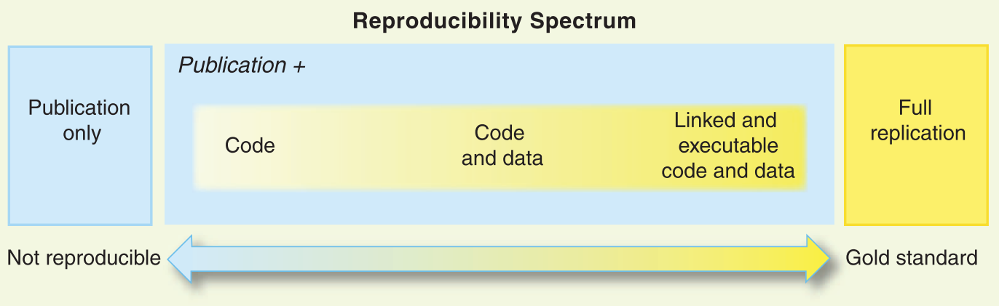
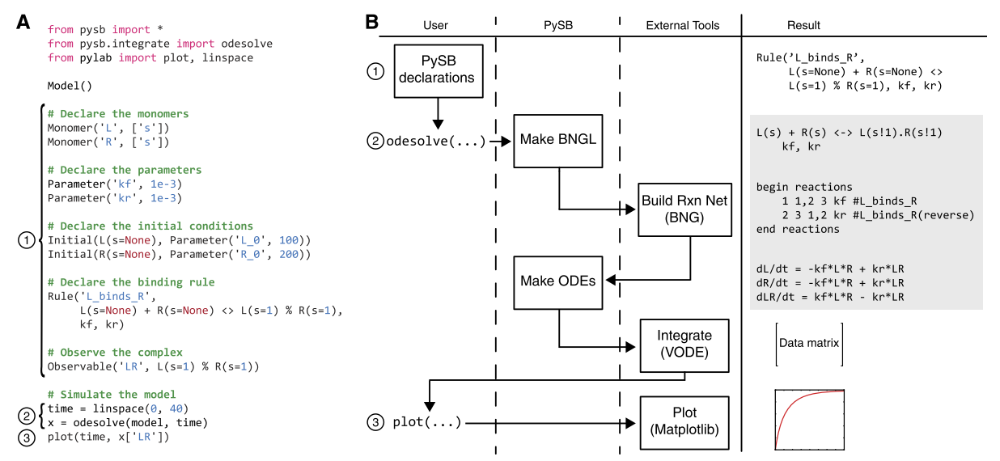
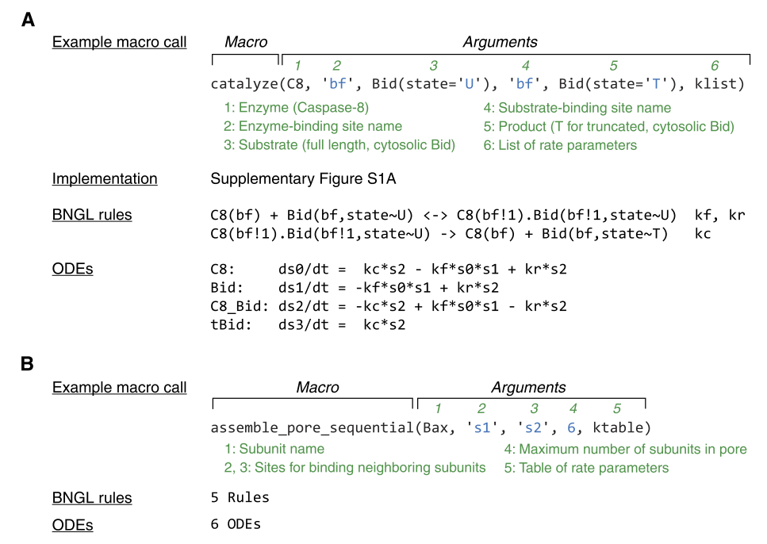
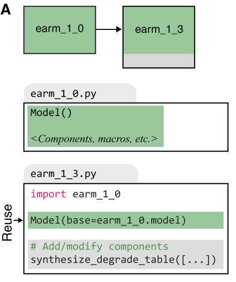
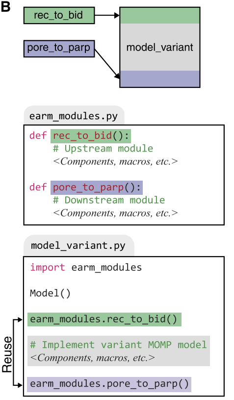

layout: true

  

 

---

# Outline

.big[
- .blue[Intro: Science Tales]
- .red[General Crisis] in Science?
- .green[Reproducibility] via examples
- .purple[Discussion]
]

---

# Science as a Tale

.pull-left[

]
--
.pull-right.large[
- Great Scientists are like granpas with good old tales!
  
- Elements of a good story
  
- Science dissemination (a historical perspective)
  
- Techonological progress
]

???
- Elements of a good story: **concise, easy to rememeber, carries a central message** that others can carry further on, there is some **magic** to it that captivates you
- Science dissemination has changed: from **text (story)** now we have to present **evidence** (experiments, be it computational or lab) that accompany it (even in Math some proofs are now computational).
- Woods in the fire and taking measurements => experimental evidence!
- Paradigm shift in Science dissemination with techonology's progress has brought more challenges (**Material and Methods in papers, presenting reports**, etc...)
- That has brought a challenge: **experiments that cannot be reproduced are blocking progress**.

---

# Crisis in Science?

.large[Research on Research: **meta-research**]
--

> Most of the proposed associations and/or effects are either .red[False or exaggerated] .purple[Ioannidis (2005&2008)]

> Estimated .red[85%] of research resources are .red[wasted]! .purple[Macleod et. al (2014)]

--

.blue.large[LOTS OF REASONS]:

- Methods not well explained (**desing/analysis/standards flexibility**)   
- Insufficient data sharing (**access policies, resource access**)  
- Results are .red.bold[not reproducible]  
- Hot scientific field (**Proteus phenomenon**)
- Financial interests and prejudices (**high bias**)
- *P-hacking*, **confirmation and hindsight biases**
- Small sample and effect sizes (**low study power** $1-\beta$)
- **Low pre-study odds** $R$

--

... there is .bold.green[progress] though - how can we can make things better?

???
- Notice that there are some risk factors associated with FP findings that are immutable, e.g. small effect sizes (**Finding a needle in a haystack**)
- *are either False or exaggerated* => False here means False Positives
- **Advice by Ioannidis (ECCB 2018)**: based on a reproducibility Nature study => read only Nature & Science and cut the results (effect-wise) in half!
- Ioannidis (2005): statistical analysis based on modeling the Framework for False Positive Findings finds the **key factors that make most research findings to be FALSE**: **pre-study odds, bias and study power** (they all relate to **PPV** - prob. of a statistical significant research finding to be TRUE)
- The **Proteus phenomenon** is the tendency in science for early replications of a work to contradict the original findings, a consequence of publication bias and competition.
- **Confirmation bias** (the tendency to focus on evidence that is in line with our expectations or favoured explanation) and **hindsight bias** (the tendency to see an event as having been predictable only after it has occurred) can easily lead us to false conclusions (+ apophenia => see relations in unrelated/random things)
- Claimed Research Findings May Often Be Simply **Accurate Measures of the Prevailing Bias** [Ioannidis2005]
- *Reproducibility Wars*!!!

---

# How to make more published research true?

> .larger[*“To make more published research true, practises [should] include the adoption of large-scale collaborative research; replication culture, registration; sharing, reproducibility practices; better statistical methods; standardization of definitions and analyses; more appropriate (usually more stringent) statistical thresholds; and improvement in study design standards, peer review, reporting and dissemination of research and training of the scientific workforce.”*]   .purple[Ioannidis (2014)]

.large[Role of .blue[Stakeholders] (diverse motives)]  
.large[.blue[Research Currencies]: need for a better *Reward system* for Science]

???

- Transparency is superior to trust (reproducibility)
- Peer review is changing: the collective wisdom of the scientific community can be harnessed: **PREPRINTS**
- **Stakeholders** differ in their extent of interest with regards to research results that are **publishable, fundable (money in), translatable, profitable (money out)**.
There are **complex dynamics** between different stakeholders that shape research practices.
Note that a scientist can have many *stakeholding* roles!
- **On Currencies**: Scientists may continue publishing and getting grants (2 key currencies) without making real progress, if **more publications and more grants are all that matters**.
**Academic Hierarchy**: researchers at higher ranks have more papers and more grants.
Sexism, nepotism, cronyism => might also influence academic currencies.
**(High quality) Peer review** is not rewarded.
**Replication** is not rewarded.
- Ioannidis (2014) proposes a table of changes and rewards and discusses what it would mean to have such a paradigm shift in how research is rewarded. 

---
# Reproducibility 101

.large[**Three forms** of reproducibility: *statistical, empirical, and computational*] .purple[Stodden (2014)]

> .larger[*“A research project is .green[computationally reproducible] when a second investigator (including you in the future) can recreate the final reported results of the project, including key quantitative findings, tables, and figures, given only a set of files and written instructions.”*]   .purple[Kitzes (2017)]

 
.large[.blue[Replication = new data + isomorphic methods] or getting exactly the same results computationally (.red[harder])]

???

- Gain a minimum level of credibility
- Reproducibility (should be easy to achieve) vs Replicability (difficult) argument

---

# .little[Top 5 Tips to Make Your Research Irreproducible!]

.larger[
1. Think “.bold.green[Big Picture]”
2. .bold.blue[Be abstract]
3. Short and sweet
4. The *deficit* model
5. .red.bold[Don't share]
]

.purple[Hong et al. (2015)]

--

 
.larger[.blue[Top Tip]: *“to ensure your work is irreproducible, make sure that you cannot reproduce it yourself”*]

???
1. Don't describe experimental stuff, people are interested in Science!
2&3. No need to show all the **subtle implementation details** and expose the limitations to your methods
4. **Hierarchy** of experts and non-experts (you are the expert, you define what is what, benchmarks, etc.)
5. Other people to scoop your research ideas, understand how your code actually works instead of why you say it does, or worst of all to understand that **your code doesn’t actually work at all**.

---

# Remember: Reproducibility needs work!

--

.larger[
- Technical expertise
- Use the right tools, follow .green[*standards*]
- Ask for .blue[advice]!
- Research work and Reproducibility practice .green[*balance*]
]

???
- How much information suffices for reproduction becomes clear only when it is attempted

---

# .little[Good Practises for Computational Reproducibility]

- .larger[Publish your **code** (e.g. GitHub)] .large.purple[Barnes (2010)]
- .larger[Publish your **data** (e.g. Zenodo, Figshare)]
- .larger[**Link executable code with data** (e.g. Code Ocean] .large.purple[Clyburne-Sherin et al. (2019)] .larger[, WholeTale] .large.purple[Brinckman et. al (2019)].larger[)]
- .larger[Develop a .blue[culture of reproducibility]] .large.purple[Peng (2011)]

.small[Figure from .purple[Peng (2011) *Reproducible Research in Computational Science*]]

???

- **Document and test** your code is equally important :)
- Code Ocean is a **cloud-based computational reproducibility platform** (uses Docker) - anything can be reproduced with the press of a button, and each published capsule is assigned a DOI.
- Related work includes Galaxy

---

# Example 1: A Reproducible Report in R

.blue.larger[Quidelines]

.large[
- Use Rmarkdown, GitHub and GitHub pages `r shiny::icon(name = "github")`
- *1 Figure = 1000 words* `r shiny::icon(name = "images")`
- .red[Include Software versions, dependencies] `r shiny::icon(name = "file-code")`
- Hide your code!
- Make sure your .purple[links work]! `r shiny::icon(name = "link")`
- Cite your References
- .green[Color boxes] for important messages (**capture reader's attention**)
- *TOC* (always on the left, provides a bird-eye view)
]

 
.large[`rtemps` R package: [United-HTML Report](https://bblodfon.github.io/rtemps/united-html/united-html.html)]

---
# Example 2: Docker Containers 

.larger[**Docker** allows you to package an application with all of it's dependencies into a .blue[standardized unit] for reproducible (software) research]

.larger.green[Advantages]
- .large[Fast instantiation]
- .large[Native performance]
- .large[Easy to use, build, share and publish]
- .large[Lightweight and Portable]

--

.large[ => Your own .bold[compute [time-capsule](https://codeocean.com/capsule/8235972/tree/v6)]!!!]

???

- **Lightweight**: a Docker container “does not replicate the full operating system, only the libraries and binaries of the application being virtualized”

---

# .small[Example 3: SE .red[(*)] concepts in Reproducible Modeling]

.blue[PySB]: a Python-based framework for *rule-based*, *programmatic*, ODE modeling .purple[Lopez et. al (2013)] - **models are programs**!!!

.red[(*) => Software Engineering]

???

- **Motives**: Difficult to manage equations directly or to combine previously developed models (historical perspective)
**Absense of validation and testing** (models published before or around 2010)
- **Reversible binding of proteins L and R** ("Hello World" program) reads as follows: when the proteins L and R both have empty binding sites s (e.g., L(s=None)), they reversibly bind to form a complex that shares a single ‘bond’ (e.g., L(s=1) % R(s=1)), at rates kf (forward) and kr (reverse)

---

# .small[SE concepts in Reproducible Modeling: .blue[Abstraction   and Composition]]

???

- Through **abstraction**, the core features of a concept or process are separated from the particulars: for example, **a pattern of biochemical reactions** (e.g., phosphorylation–dephosphorylation of a substrate) is described once in a generic form as a subroutine and then instantiated for specific models simply by specifying the arguments.
- Functions can be built up from other functions, a process known as **composition**.
- A **catalytic reaction** in which active *Caspase-8 (C8)* binds to untruncated *Bid* (Bid(state=U)) to yield *tBid* (Bid(state=T)).
- **Assembly of a pore in a sequential fashion** in which monomers bind to form dimers, dimers bind monomers to form trimers, trimers bind monomers to form tetramers, etc. 
**5 rules** (for binding of monomers to monomers, monomers to dimers, monomers to trimers, etc) and **** species and ODEs (monomers through hexamers).

---

# .small[SE concepts in Reproducible Modeling: .blue[Modularization]]

.pull-left[]
.pull-right[]

???

- A: **Direct reuse and subsequent modification** of pre-existing model code.
- B: **Reuse of modules using macros**. 
Macros instantiating the components for the upstream (rec_to_bid) and downstream (pore_to_parp) portions of the extrinsic apoptosis pathway are placed in a Python file, `earm_modules.py`. 
Variant models differing only in the reaction topology for MOMP initiation (e.g., model_variant.py) are then created by invoking these macros for the shared **upstream and downstream elements.**
- **MOMP**: Mitochondrial outer-membrane permeabilization
- There is also **Class Reuse**: a more sophisticated approach that exploits the class inheritance mechanism in Python.
- Enable **test and validation** of submodules!

---

# Discussion

.center[
.large[Reproducibility and Responsibility (.blue[RRI == REFLECT])]    

]

---

class: center, middle

# Thanks!

----

Slides created with the R package [**xaringan**](https://github.com/yihui/xaringan)

Code for the slides: [https://github.com/bblodfon/r-pres](https://github.com/bblodfon/r-pres)
`r shiny::icon("github")`

